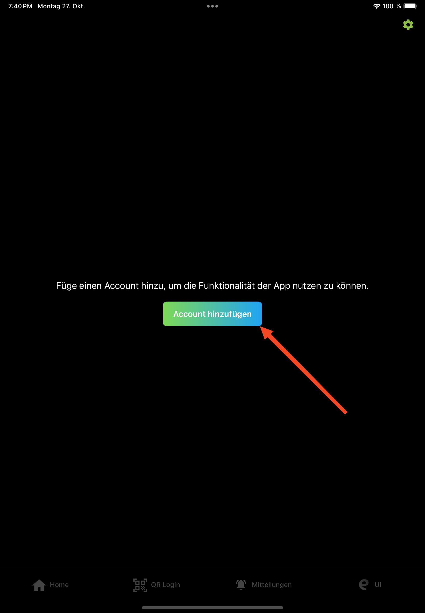
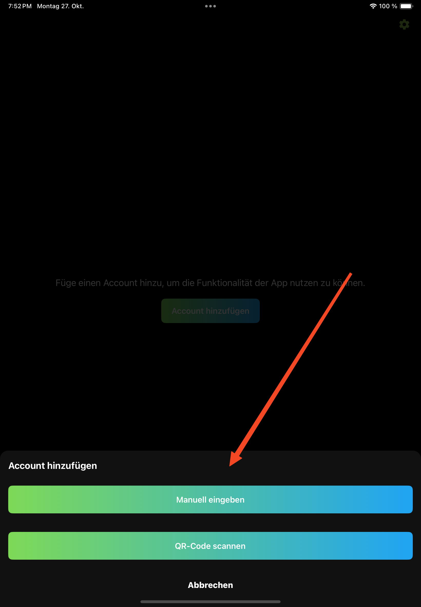
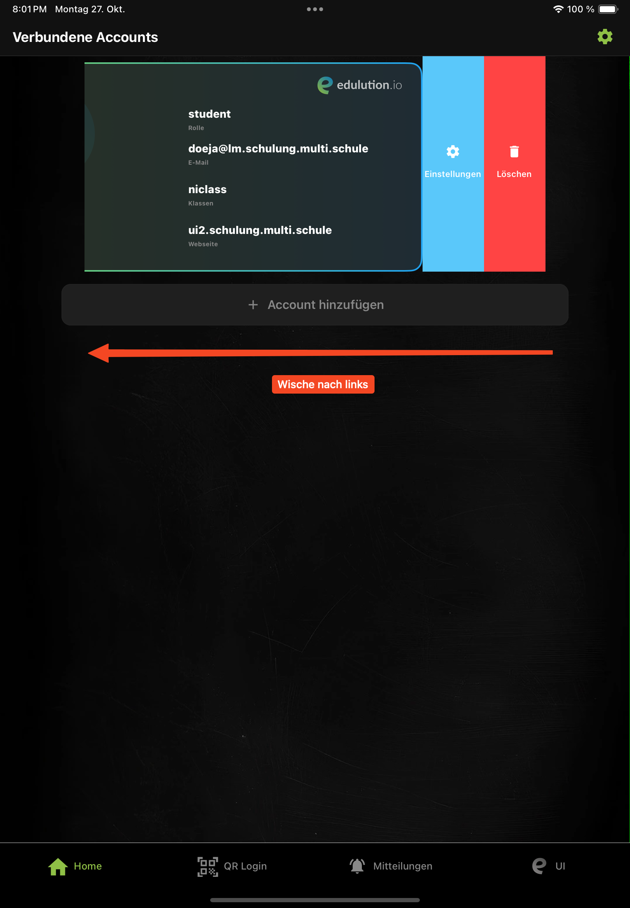

# Einrichtung der edulution App
:::warning Wichtiger Hinweis für bestehende Nutzer
Wenn Sie eine App-Version **älter als 2.1.0** verwenden, empfehlen wir dringend, die App zu **deinstallieren und neu herunterzuladen**, um Fehler zu vermeiden.
:::

## App herunterladen

Scanne den QR-Code mit deinem iPhone oder iPad, um direkt zum Apple App Store weitergeleitet zu werden und die neueste Version der edulution App herunterzuladen.

  

## Account hinzufügen

### Wie richtet man einen Account ein?

Wenn die App zum ersten Mal geöffnet wird, muss zunächst ein Account hinzugefügt werden, um den vollen Funktionsumfang der App nutzen zu können.

Klicke auf den Button **"Account hinzufügen"**, um den Einrichtungsprozess zu starten.

### Voraussetzungen

Bevor du einen Account hinzufügst, stelle sicher, dass du folgende Informationen bereithältst:

- Deine Zugangsdaten (Benutzername und Passwort)
- Die Server-Adresse deiner Schule
- Optional: QR-Code für die schnelle Einrichtung

---

## Account hinzufügen

Nach dem Klick auf "Account hinzufügen" erscheint ein Auswahlmenü mit zwei Möglichkeiten:

### 1. Manuell eingeben

Manuelle Eingabe der Zugangsdaten:

- Schulserver-Adresse
- Benutzername
- Passwort

### 2. QR-Code scannen

Beim Scannen des QR-Codes werden alle benötigten Daten automatisch übernommen - nur noch das Passwort muss eingegeben werden.

**So lässt sich der QR-Code finden:**

1. Anmeldung auf der edulution Plattform der Schule
2. Navigation zu **"Mein Profil"**
3. Auswahl von **"Mobiler Zugriff"**
4. Scannen des **zweiten angezeigten QR-Codes**

---

## Account-Einstellungen

Um auf die Einstellungen eines Accounts zuzugreifen, muss die Account-Karte nach links gewischt werden. Es erscheinen dann zwei Optionen:

