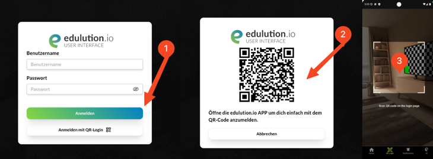

# Einrichtung der edulution App

## Account hinzufügen

### Wie richtet man einen Account ein?

Wenn die App zum ersten Mal geöffnet wird, muss zunächst ein Account hinzugefügt werden, um den vollen Funktionsumfang der App nutzen zu können.

Klicke auf den Button **"Account hinzufügen"**, um den Einrichtungsprozess zu starten.

### Voraussetzungen

Bevor du einen Account hinzufügst, stelle sicher, dass du folgende Informationen bereithältst:

- Deine Zugangsdaten (Benutzername und Passwort)
- Die Server-Adresse deiner Schule
- Optional: QR-Code für die schnelle Einrichtung

---

## Account hinzufügen

Nach dem Klick auf "Account hinzufügen" erscheint ein Auswahlmenü mit zwei Möglichkeiten:

### 1. Manuell eingeben

Manuelle Eingabe der Zugangsdaten:

- Schulserver-Adresse
- Benutzername
- Passwort

### 2. QR-Code scannen

Beim Scannen des QR-Codes werden alle benötigten Daten automatisch übernommen - nur noch das Passwort muss eingegeben werden.

**So lässt sich der QR-Code finden:**

1. Anmeldung auf der edulution Plattform der Schule
2. Navigation zu **"Mein Profil"**
3. Auswahl von **"Mobiler Zugriff"**
4. Scannen des **zweiten angezeigten QR-Codes**

---

## Account-Einstellungen

Um auf die Einstellungen eines Accounts zuzugreifen, muss die Account-Karte nach links gewischt werden. Es erscheinen dann zwei Optionen:

### Einstellungen

Zugriff auf die Account-Verwaltung mit folgenden Möglichkeiten:

- Passwort ändern
- Dateifreigaben verwalten
- Datenschutz / Impressum der Schule

### Löschen

Entfernt den Account vollständig aus der App. Alle lokalen Daten des Accounts werden dabei gelöscht.

---

## Account-Einstellungen im Detail

In den Account-Einstellungen können verschiedene Aspekte des Accounts verwaltet werden:

### Profil

**Aktives Profil:** Legt fest, ob dieser Account für alle Aktionen verwendet werden soll. Es kann immer nur ein Account aktiv sein.

### Dateisystem

Verwaltung der Dateifreigaben, die in der Dateien-App angezeigt werden sollen:

- Anzeige aller verfügbaren Freigaben
- Hinzufügen neuer Freigaben über den Button "Freigabe hinzufügen"
- Aktivierung/Deaktivierung einzelner Freigaben
- Status: Aktiv oder Inaktiv

### Passwort

Änderung des Account-Passworts:

- Eingabe des Benutzernamens
- Eingabe des neuen Passworts
- Speicherung über den Button "Passwort speichern"

### Rechtliches

Zugriff auf rechtliche Dokumente:

- Datenschutzerklärung der Organisation
- Impressum der Organisation

---

## QR-Login

Die QR-Login-Funktion ermöglicht eine schnelle Anmeldung auf der edulution-Plattform ohne manuelle Eingabe von Zugangsdaten.

### Verwendung

- Öffnen der Login-Seite der edulution-Plattform im Browser
- Auswahl von "QR Login" in der App-Navigation
- Scannen des auf der Login-Seite angezeigten QR-Codes
- Automatische Anmeldung mit dem aktiven Account

### Vorteile

- Keine Eingabe von Benutzername oder Passwort erforderlich
- Schnelle und sichere Anmeldung
- Verwendet den in der App aktiven Account

---

## Mitteilungen

Im Mitteilungen-Bereich werden aktuelle Benachrichtigungen und Aktivitäten angezeigt.

### Funktion

Hier werden aktuelle Mitteilungen angezeigt, beispielsweise:

- Konferenz wurde gestartet
- Neue Nachrichten
- Systembenachrichtigungen
- Aktualisierungen

### Verwaltung

- Alle Mitteilungen können über das Mülleimer-Icon gelöscht werden
- Push-Mitteilungen können in den Einstellungen aktiviert werden
- Mitteilungen werden chronologisch angezeigt

### Push-Benachrichtigungen

Wenn Push-Mitteilungen deaktiviert sind, erscheint ein Hinweis mit der Möglichkeit, diese in den Systemeinstellungen zu aktivieren.

---

## UI - edulution Plattform

Der aktive Account wird verwendet, um sich automatisch bei der edulution-Plattform der Organisation anzumelden. Hierdurch besteht voller Zugriff auf den kompletten Funktionsumfang von edulution.

### Automatische Anmeldung

Durch Auswahl von "UI" in der App-Navigation erfolgt eine automatische Anmeldung bei der edulution-Plattform mit dem aktiven Account. Es ist keine manuelle Eingabe von Zugangsdaten erforderlich.

### Zugriff

- Vollständiger Zugriff auf alle edulution-Funktionen
- Nutzung aller digitalen Lehr- und Lernanwendungen
- Zugriff auf persönliche Daten und Ressourcen der Organisation

---

## Schüler-/Lehrerausweis

Durch Antippen eines Accounts auf der Startseite wird der digitale Schüler- oder Lehrerausweis angezeigt.

### Anzeige

Der digitale Ausweis zeigt alle relevanten Informationen des Accounts an, einschließlich:

- Profilbild
- Name und Geburtsdatum
- Schulinformationen
- Adressdaten
- Gültigkeitsdauer

### Zugriff

Der Ausweis kann durch Antippen der Account-Karte auf der Startseite aufgerufen werden.

---

## App-Einstellungen

Durch Antippen des Einstellungs-Icons (Zahnrad) oben rechts auf der Startseite werden die allgemeinen Einstellungen der edulution-App angezeigt.

### Erscheinungsbild

Auswahl des App-Themes:

- **Hell:** Immer heller Modus
- **Dunkel:** Immer dunkler Modus
- **Automatisch:** Folgt der Systemeinstellung

### Rechtliches

Zugriff auf rechtliche Dokumente von edulution:

- **Datenschutz:** Allgemeine Datenschutzerklärung von edulution.io
- **Impressum:** Impressum von edulution.io