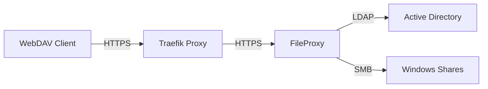

# edulution FileProxy

WebDAV-zu-SMB Proxy für sicheren Dateizugriff auf Windows-Shares.

## Was ist FileProxy?

**edulution-fileproxy** verbindet WebDAV-Clients (Browser, mobile Apps, Desktop-Programme) mit Windows-Dateifreigaben (SMB/CIFS). Entwickelt für Bildungseinrichtungen, ermöglicht es Schülern und Lehrern plattformübergreifenden Zugriff auf ihre Netzlaufwerke.

### Kernfunktionen

- 🔐 **LDAP-Authentifizierung** - Zentrale Anmeldung über Active Directory
- 🔄 **Credential-Passthrough** - Jeder User sieht nur seine eigenen Dateien
- 🚀 **Performance** - Optimiert in Go für hohe Geschwindigkeit
- 🔒 **TLS-Verschlüsselung** - Sichere HTTPS-Verbindung standardmäßig
- 📱 **Plattformunabhängig** - Funktioniert auf allen Geräten

## Architektur

**Ablauf:**
1. User gibt LDAP-Credentials im WebDAV-Client ein
2. FileProxy authentifiziert gegen LDAP
3. FileProxy nutzt User-Credentials für SMB-Verbindung
4. User sieht nur eigene Dateien mit eigenen Berechtigungen

## Installation

Die Installation erfolgt in 4 Schritten:

1. **[Package Server](./package-server)** - Edulution Repository einrichten
2. **[FileProxy installieren](./installation)** - Server aufsetzen und konfigurieren
3. **[Traefik konfigurieren](./traefik-config)** - Reverse Proxy einrichten
4. **[UI konfigurieren](./ui-config)** - WebDAV in edulution aktivieren

## Voraussetzungen

- Ubuntu 24.04 LTS
- 4 GB RAM, 2 CPU Kerne
- Zugriff auf LDAP-Server (Port 636/389)
- Zugriff auf SMB-Server (Port 445)
- Edulution UI mit Traefik

## Erste Schritte

Beginnen Sie mit der [Package Server Einrichtung](./package-server) →
