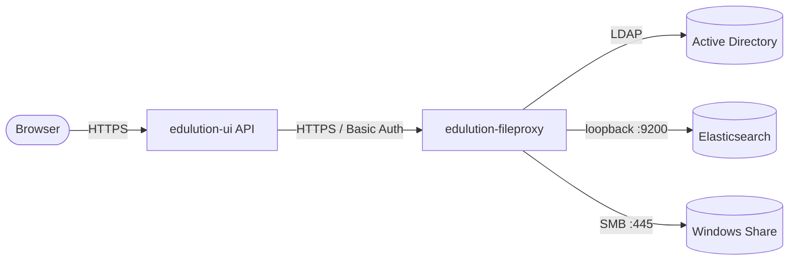

# Wiki-Infrastruktur

Server-seitige Komponenten und Einrichtung des **Wiki**-Features in edulution. Das Wiki ist ein integraler Bestandteil des FileProxy mit eigenem Suchindex und in `config.example.yml` standardmäßig aktiviert. Hosts ohne Wiki-Bedarf können es über `elasticsearch.enabled: false` in `/etc/edulution-fileproxy/config.yml` deaktivieren.

:::info Vorgelagerte Schritte
Dieses Dokument setzt eine funktionierende FileProxy-Installation voraus. Folgen Sie zuerst der [Installation](./installation), [Traefik-Konfiguration](./traefik-config) und [UI-Konfiguration](./ui-config).
:::

## Architektur-Überblick

Das Wiki erweitert den FileProxy um einen **Elasticsearch-Sidecar** für die Volltextsuche und ein paar zusätzliche HTTP-Endpunkte. Wiki-Seiten sind ganz normale Markdown-Dateien, die in einem versteckten Ordner `.wiki/` innerhalb jeder SMB-Freigabe liegen.



**Komponenten:**

| Komponente | Aufgabe | Deployment |
|---|---|---|
| edulution-ui API | Empfängt Browser-Anfragen, prüft Berechtigungen, leitet an FileProxy weiter | Docker (`edulution-api`) |
| edulution-fileproxy | WebDAV-Operationen, Wiki-Endpunkte, Indexierung von Änderungen | Host-Binary via systemd |
| Elasticsearch | Volltextindex der Wiki-Seiten mit ACL-Filter | Docker-Sidecar (loopback) |
| SMB-Server | Persistente Speicherung der `.md`-Dateien | Linuxmuster Fileserver |

## Voraussetzungen für die Wiki-Funktion

- FileProxy 1.x mit Elasticsearch-Unterstützung
- Docker auf dem FileProxy-Host (für den ES-Sidecar)
- Mindestens 1,5 GB freier RAM (1 GB ES + Headroom für FileProxy)
- LDAP `base_dn` konfiguriert
- Indexer-Konto auf allen SMB-Backends bekannt

## Einrichtung

### 1. FileProxy installieren

Folgen Sie der [Installations-Anleitung](./installation). Die Wiki-Funktionalität ist in der mitgelieferten `config.example.yml` standardmäßig aktiviert – die folgenden Schritte schließen die Einrichtung ab (Indexer-Konto, ES-Sidecar, Erstindex).

### 2. Indexer-Konto hinterlegen

FileProxy braucht ein AD-Konto, mit dem es während der Indexierung die SMB-Inhalte lesen darf. Standardmäßig wird das vorhandene `global-admin`-Konto verwendet – `config.example.yml` referenziert es bereits als `smb.indexer_service_account` und erwartet das Passwort unter `/etc/edulution-fileproxy/indexer.secret`. Es genügt also, das Passwort an diesen Pfad zu schreiben:

```bash
echo -n 'GEHEIM' | sudo tee /etc/edulution-fileproxy/indexer.secret
sudo chmod 600 /etc/edulution-fileproxy/indexer.secret
```

Stellen Sie zusätzlich sicher, dass `ldap.base_dn` in `/etc/edulution-fileproxy/config.yml` gesetzt ist:

```yaml
ldap:
  base_dn: "DC=linuxmuster,DC=lan"   # PFLICHT für ACL-Auswertung
```

:::caution base_dn ist Pflicht
Ohne `ldap.base_dn` kann FileProxy keine Gruppen-SIDs zur Berechtigungsprüfung auflösen – die Suche liefert dann keine Treffer.
:::

:::tip Anderes Indexer-Konto verwenden
Wenn `global-admin` nicht passt, kann in `config.yml` unter `smb.indexer_service_account.user` ein beliebiger AD-Benutzer mit Leseberechtigung auf den indexierten Pfaden eingetragen werden.
:::

### 3. Elasticsearch-Sidecar starten

Der ES-Sidecar wird als Docker-Container neben dem Host-Binary betrieben. Eine fertige Compose-Datei liegt im FileProxy-Repository unter `docs/deployment/docker-compose.yml`.

```bash
cd /opt/edulution-fileproxy/deployment   # oder anderer Pfad mit der compose-Datei
sudo docker compose up -d
```

Eckdaten der Standard-Konfiguration:

| Parameter | Wert | Begründung |
|---|---|---|
| Image | `elasticsearch:8.19.3` | gepinnt; getestet mit FileProxy |
| Heap | `-Xms512m -Xmx512m` | passend zu ~50.000 Wiki-Dokumenten |
| Memory-Limit | `1 GB` | verhindert, dass ES das FileProxy-Working-Set verdrängt |
| Bind | `127.0.0.1:9200` | nur Loopback – `xpack.security.enabled=false` |
| Volume | `es-data` (named volume) | überlebt Container-Neustarts |

:::warning Loopback-Bindung niemals aufweichen
Da Security in Elasticsearch deaktiviert ist, würde jede Bindung an externe Interfaces einen kompletten Cluster-Takeover ermöglichen. ES darf ausschließlich auf `127.0.0.1` lauschen.
:::

Größere Installationen (mehr als ~10.000 Seiten oder mehrere Schulen) sollten die Heap- und Memory-Werte gemäß `docs/deployment/es-sizing-recipe.md` im FileProxy-Repository anpassen.

### 4. FileProxy starten

`elasticsearch.enabled: true` ist in der mitgelieferten `config.example.yml` bereits gesetzt – ein Eingriff in `/etc/edulution-fileproxy/config.yml` ist nur nötig, wenn die Wiki-Funktion auf diesem Host **nicht** aktiv sein soll (dann `enabled: false`). Zur Kontrolle:

```yaml
elasticsearch:
  enabled: true
  url: "http://127.0.0.1:9200"
```

Anschließend FileProxy starten bzw. neu starten:

```bash
sudo systemctl restart edulution-fileproxy
```

Beim Start legt FileProxy automatisch den Index `wiki-md` (Alias auf eine versionierte Variante `wiki-md-vN`) an und startet den Worker-Pool sowie den Drift-Reconciler.

### 5. Initialen Index aufbauen

Pro Freigabe einmalig den Reindex-Lauf starten:

```bash
sudo edulution-fileproxy-reindex --share agy
sudo edulution-fileproxy-reindex --share linuxmuster-global
```

Der Lauf durchsucht den Share nach `.wiki/**/*.md`-Dateien und indiziert sie. Während des Laufs bleibt FileProxy ansprechbar – neue oder geänderte Dateien werden parallel über den **PostWriteHook** indiziert.

### 6. UI-Verbindung prüfen

In edulution-ui ist die Verbindung zum FileProxy in den **Datei-Freigaben** hinterlegt (siehe [UI-Konfiguration](./ui-config)). Pro Freigabe wird die FileProxy-URL gespeichert; ein einzelner FileProxy kann beliebig viele SMB-Backend-Server bedienen.

Die Sichtbarkeit pro Wiki steuert der Global-Admin in der edulution-UI unter **Einstellungen → Wiki → Wiki-Sichtbarkeit** (siehe [Wiki-Einstellungen](../edulution-ui/administration/wiki-einstellungen)).

## Berechtigungen

Die Berechtigungsprüfung erfolgt **fail-closed**:

1. edulution-ui sendet bei jedem FileProxy-Aufruf den Header `X-Edulution-Groups` mit den AD-Gruppen des Users.
2. FileProxy übersetzt die Gruppen in SIDs.
3. Elasticsearch filtert mit einem Terms-Filter auf das Feld `acl_allow` jedes Dokuments.
4. Dokumente ohne passende ACL erscheinen weder in der Suche noch in der Listenansicht.

Zusätzlich wird in edulution-ui die [Wiki-Sichtbarkeit](../edulution-ui/administration/wiki-einstellungen) pro Freigabe geprüft (Wiki aktiv? Zugriffsgruppen?). Diese zweite Stufe wirkt **vor** dem FileProxy-Aufruf – ein deaktiviertes Wiki wird gar nicht erst abgefragt.

## Multi-Server-Deployments

Ein FileProxy kann mehrere SMB-Backend-Server bedienen. In der `shares:`-Liste lässt sich pro Freigabe ein abweichender Server angeben:

```yaml
smb:
  server: "10.0.0.1"               # Standard
  shares:
    - name: default-school         # nutzt 10.0.0.1
    - name: linuxmuster-global     # nutzt 10.0.0.1
    - name: agy
      server: 10.1.0.2             # eigener Backend-Server
    - name: brs
      server: 10.2.0.2
```

Wichtig: Das `indexer_service_account` muss auf **jedem** angesprochenen Backend-Server existieren. Details siehe `docs/OPERATOR_RUNBOOK.md` im FileProxy-Repository (Abschnitt *Multi-fileserver deployments*).

## Betrieb

### Logs

```bash
# FileProxy
sudo tail -f /var/log/edulution-fileproxy/webdav-server.log

# Elasticsearch
sudo docker logs -f edulution-fp-es
```

### Health-Checks

```bash
# Elasticsearch
curl -s 'http://127.0.0.1:9200/_cluster/health?pretty'

# FileProxy Wiki-Endpunkt (Authorisierungsheader nötig)
curl -k -u global-admin:GEHEIM \
     -H 'X-Edulution-Groups: domain^admins' \
     https://fileproxy.example.schule:8443/wiki/roots
```

### Drift manuell auflösen

Sollten Inhalte und Index voneinander abweichen (z.B. nach manueller SMB-Operation außerhalb von WebDAV), kann der Reconciler vorzeitig getriggert werden, indem FileProxy neu gestartet wird. Bleibt das Problem bestehen, hilft ein Re-Index pro betroffenem Share:

```bash
sudo edulution-fileproxy-reindex --share <share-name>
```

### Ausfallverhalten

| Komponente fällt aus | Auswirkung |
|---|---|
| Elasticsearch | WebDAV-Lese-/Schreibzugriff bleibt funktionsfähig; Wiki-Suche liefert keine Treffer mehr; PostWriteHook puffert nichts (neue Änderungen werden erst beim nächsten Reconciler-Lauf nachindiziert) |
| FileProxy | Sowohl Datei- als auch Wiki-Funktionen sind nicht erreichbar |
| SMB-Server | Lesezugriff auf gepufferte Suchergebnisse bleibt möglich; Schreibzugriffe schlagen fehl |
| LDAP | Authentifizierung schlägt fehl; bestehende Sessions laufen bis zum Timeout weiter |

## Datenflüsse

**Seite öffnen**

```
Browser → edulution-ui API → fileproxy (WebDAV GET) → SMB
                                                     → ETag im Header
```

**Seite speichern (mit Konflikterkennung)**

```
Browser → edulution-ui API → fileproxy (WebDAV PUT, If-Match)
                              ├─ SMB schreiben
                              └─ PostWriteHook → Elasticsearch upsert
```

**Suchen**

```
Browser → edulution-ui API → fileproxy POST /wiki/search
                              → Elasticsearch query mit ACL-Filter
                              ← Treffer mit Snippets
```

**Drift-Reparatur (alle 15 Minuten)**

```
fileproxy Reconciler → SMB durchwandern (.wiki/ pro Freigabe)
                     → Diff gegen Elasticsearch
                     → fehlende Docs nachindexieren / gelöschte entfernen
```

## Speicherlayout

Wiki-Inhalte liegen in versteckten `.wiki/`-Ordnern direkt im SMB-Share:

```
/shares/agy/                      ← Share-Root
├─ .wiki/                         ← Wiki-Inhalt auf Share-Ebene
│  ├─ index.md                    ← optionale Startseite des Shares
│  └─ vertretung.md               ← Seite direkt im Share
├─ kontakte/                      ← regulärer Unterordner
│  └─ .wiki/                      ← Wiki-Inhalt des Unterordners
│     ├─ index.md                 ← Startseite des Unterordners
│     └─ leitung.md
└─ unterricht/                    ← Ordner ohne .wiki/ wird beim Indexieren ignoriert
   └─ klassenarbeiten.zip
```

Ein `.wiki/`-Ordner enthält ausschließlich Markdown-Dateien (`*.md`), keine weiteren Unterordner. Die hierarchische Struktur eines Wikis entsteht durch reguläre Ordner im Share – jeder davon kann optional ein eigenes `.wiki/` mit weiteren Seiten enthalten. Eine `index.md` darin macht eine Seite zur **Startseite des Ordners**. Reguläre Dateien außerhalb von `.wiki/`-Ordnern werden nicht indiziert.

## Siehe auch

- [Installation](./installation) – Grundinstallation des FileProxy
- [UI-Konfiguration](./ui-config) – FileProxy-URL und Freigaben in edulution-ui
- [Wiki (Nutzerhandbuch)](../edulution-ui/features/wiki) – Funktionen aus Sicht der Endbenutzer
- [Wiki-Einstellungen (Admin)](../edulution-ui/administration/wiki-einstellungen) – Sichtbarkeit pro Freigabe steuern
