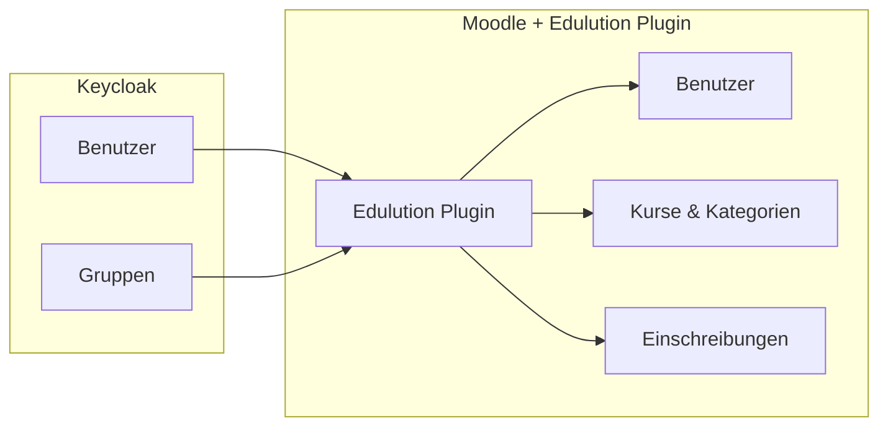

# edulution Moodle Plugin

Das **Edulution Moodle Plugin** ist ein lokales Moodle-Plugin, das die automatische Synchronisierung von Benutzern und Gruppen aus Keycloak ermöglicht. Es ist speziell für den Einsatz in Schulumgebungen konzipiert.

## Was macht das Plugin?

Das Plugin synchronisiert automatisch:

- **Benutzer** aus Keycloak nach Moodle
- **Gruppen** werden zu Moodle-Kursen mit automatischer Benennung
- **Einschreibungen** basierend auf Gruppenmitgliedschaften
- **Rollen** (Lehrer werden automatisch als Trainer erkannt)



## Hauptfunktionen

### Intelligente Gruppen-Erkennung

Das Plugin erkennt automatisch verschiedene Gruppentypen anhand ihrer Namen:

| Keycloak-Gruppe | Wird zu | Kategorie |
|-----------------|---------|-----------|
| `p_alle_mathe` | Fachschaft Mathematik | Fachschaften |
| `p_mueller_bio_10a` | Biologie Klasse 10A (MUELLER) | Kurse/Stufe 10 |
| `p_8b_deutsch` | Deutsch 8B | Klassen/Stufe 8 |
| `p_robotik_ag` | AG: Robotik | AGs |
| `10a-students` | Klasse 10A | Klassen/Stufe 10 |

:::tip Automatische Erkennung
Die Standard-Namensschemas erkennen automatisch Fachschaften, Lehrerkurse, Klassenkurse, AGs und Projekte. [Mehr erfahren →](./namensschemas.md)
:::

### Automatische Kategorien

Das Plugin erstellt automatisch eine übersichtliche Kategoriestruktur:

```
Edulution/
├── Fachschaften/
│   ├── Fachschaft Mathematik
│   ├── Fachschaft Deutsch
│   └── ...
├── Klassen/
│   ├── Stufe 5/
│   ├── Stufe 6/
│   └── ...
├── Kurse/
│   ├── Stufe 10/
│   └── ...
├── AGs/
└── Projekte/
```

### Lehrer-Erkennung

Lehrer werden automatisch erkannt:
- Über ein konfigurierbares Keycloak-Attribut (z.B. `sophomorixRole` oder `role`)
- Lehrer werden als **Trainer** eingeschrieben
- Schüler werden als **Teilnehmer** eingeschrieben

### Vorschau vor der Synchronisierung

Bevor etwas synchronisiert wird, können Sie eine **Vorschau** anzeigen:
- Welche Gruppen werden erkannt?
- Welche Kurse werden erstellt?
- In welchen Kategorien?

## Installation

### Voraussetzungen

- Moodle 5.0 oder höher
- Keycloak
- PHP 8.1+

### Plugin installieren

1. Plugin-Ordner nach `/local/edulution` kopieren
2. Site-Administration → Mitteilungen aufrufen
3. Installation bestätigen

Oder via CLI:
```bash
cd /var/www/html/local
git clone https://github.com/edulution-io/edulution-moodle.git edulution
php /var/www/html/admin/cli/upgrade.php
```

### Einrichtung

1. **Site-Administration → Plugins → Lokale Plugins → Edulution**
2. Keycloak-Verbindung konfigurieren (URL, Client-ID, Secret)
3. Verbindung testen
4. Synchronisierung aktivieren

Oder nutzen Sie den **Einrichtungsassistenten** beim ersten Start.

## Konfiguration

### Quick Links

| Einstellung | Pfad |
|-------------|------|
| **Dashboard** | Site-Administration → Plugins → Edulution → Übersicht |
| **Keycloak-Verbindung** | Site-Administration → Plugins → Edulution → Keycloak |
| **Synchronisierung** | Site-Administration → Plugins → Edulution → Synchronisierung |
| **Kategorien** | Site-Administration → Plugins → Edulution → Kurskategorien |
| **Namensschemas** | Site-Administration → Plugins → Edulution → Erweitert |

### Wichtige Einstellungen

| Einstellung | Beschreibung |
|-------------|--------------|
| **Keycloak-URL** | URL des Keycloak-Servers |
| **Client-ID** | Moodle-Client in Keycloak |
| **Client-Secret** | Secret des Clients |
| **Sync-Intervall** | Wie oft synchronisieren (z.B. stündlich) |
| **Namensschema** | Standard (empfohlen) |

## Nächste Schritte

<Cards>
  <Card
    to="/docs/edulution-lms/konfiguration/namensschemas"
    title="Gruppen-Namensschemas"
    text="So benennen Sie Keycloak-Gruppen richtig"
  />
  <Card
    to="/docs/edulution-lms/konfiguration/synchronisation"
    title="Synchronisation"
    text="Benutzer und Kurse automatisch synchronisieren"
  />
  <Card
    to="/docs/edulution-lms/installation/schnellstart"
    title="Schnellstart"
    text="In 10 Minuten zum Ergebnis"
  />
  <Card
    to="/docs/edulution-lms/installation/voraussetzungen"
    title="Voraussetzungen"
    text="Was Sie vor der Installation benötigen"
  />
</Cards>

:::tip Moodle in edulution nutzen
Wie Moodle als App **Lernmanagement** in edulution eingebunden wird und wie die Anmeldung ohne zweiten Login abläuft, beschreibt [Lernmanagement (Moodle)](/docs/edulution-lms).
:::
