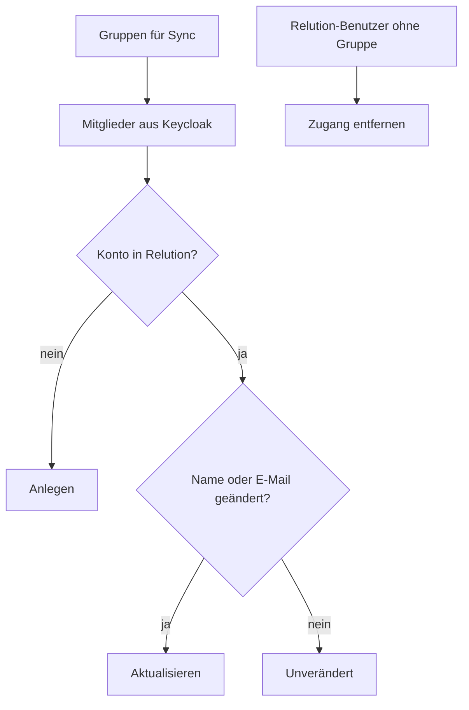

# Benutzer-Synchronisation

Damit reguläre Benutzer ihre eigenen Geräte sehen, brauchen sie ein eigenes Konto in Relution. edulution legt diese Konten selbst an – gesteuert über die **Gruppen für Sync** in der [App-Konfiguration](./app-konfiguration.md#schritt-4-gruppen-für-die-synchronisation-wählen).

## Wann die Synchronisation läuft

| Auslöser | Beschreibung |
|---|---|
| **Zeitplan** | Automatisch **einmal pro Stunde** |
| **Konfigurationsänderung** | Direkt nach dem Speichern der MDM-Einstellungen |
| **Manuell** | Über **Jetzt syncen** im Bereich [Benutzer](../benutzer.md) |

Es läuft immer nur ein Durchlauf gleichzeitig; ein zweiter Anstoß während eines laufenden Syncs wird abgewiesen.

## Was ein Durchlauf tut

1. **Mitglieder sammeln** – aus allen ausgewählten Gruppen, bevorzugt aus dem Gruppen-Cache, sonst direkt aus Keycloak.
2. **Anlegen** – fehlende Benutzer entstehen in der Organisation des Service-Accounts, mit Vor- und Nachname sowie E-Mail-Adresse aus dem Verzeichnis. Die Konten sind als **SSO-only** und **aktiviert** angelegt; ein eigenes Relution-Passwort gibt es nicht.
3. **Aktualisieren** – weicht Vorname, Nachname oder E-Mail vom Verzeichnis ab, wird das Relution-Konto nachgezogen.
4. **Aufräumen** – Relution-Benutzer, die in keiner Sync-Gruppe mehr enthalten sind, werden samt ihres API-Tokens gelöscht.

Am Ende meldet die App eine Zusammenfassung: *neu*, *aktualisiert*, *entfernt* und – falls etwas schiefging – *fehlgeschlagen*.

:::note[Fehlt eine E-Mail-Adresse]
Hat ein Benutzer im Verzeichnis keine E-Mail-Adresse, legt edulution das Relution-Konto mit einer Ersatzadresse nach dem Muster `<benutzername>@edulution.local` an. Einladungen per E-Mail können an ein solches Konto nicht zugestellt werden.
:::

## Sicherheitsnetze

| Situation | Verhalten |
|---|---|
| **Keine Gruppe konfiguriert** | Der Durchlauf endet sofort; es wird nichts angelegt und nichts gelöscht. |
| **Gruppen ergeben null Mitglieder** | Das Aufräumen wird übersprungen – ein vorübergehend leerer Verzeichnisabruf löscht so nicht die halbe Organisation. |
| **Gruppe nicht auflösbar** | Die Gruppe wird übersprungen und im Log vermerkt; die übrigen laufen weiter. |
| **Service-Account** | Wird nie angelegt, nie aktualisiert und nie gelöscht. |

## API-Token der Benutzer

Ein Benutzer bekommt seinen persönlichen Relution-API-Token nicht beim Sync, sondern **beim ersten eigenen Zugriff** auf die App. edulution erzeugt ihn dann über den Service-Account, speichert ihn mit dem [Master-Key](../../edulution-plattform/konfiguration/master-key.md) verschlüsselt und verwendet ihn fortan für alle Anfragen dieses Benutzers.

Der Bereich [Benutzer](../benutzer.md) zeigt in den Spalten **In Relution** und **Token vorhanden**, wie weit ein Benutzer ist:

| In Relution | Token vorhanden | Bedeutung |
|:---:|:---:|---|
| ✅ | ✅ | Vollständig eingerichtet |
| ✅ | – | Konto angelegt, der Benutzer hat die App noch nie geöffnet |
| – | ✅ | Verwaister Eintrag – der Zugang lässt sich über **Auswahl löschen** bereinigen |

:::caution[Bestehende Relution-Benutzer werden übernommen]
Existiert in Relution bereits ein Konto mit demselben Benutzernamen, übernimmt edulution es standardmäßig, statt den Sync scheitern zu lassen. Das ist erwünscht, wenn Relution ausschließlich von edulution bespielt wird. Teilen Sie die Relution-Organisation mit einem anderen Werkzeug, prüfen Sie die Namensräume vorher – sonst kann ein fremdes Konto in die edulution-Verwaltung geraten. Die Übernahme wird im API-Log protokolliert.
:::

## Nächster Schritt

[Fehlerbehebung →](./fehlerbehebung.md)
