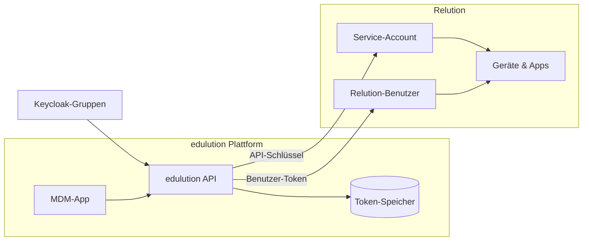

# Einrichtung

Die App **MDM** bringt kein eigenes Backend mit: Sie ist die Oberfläche zu einer **Relution**-Instanz, die Sie betreiben oder als Cloud-Dienst beziehen. Eingerichtet wird deshalb nicht Relution selbst, sondern die Verbindung dorthin.

Die Einrichtung führt ein **Global-Administrator** einmalig durch und besteht aus vier Schritten:

  <a href="/docs/edulution-mdm/einrichtung/voraussetzungen" className="card">
    <h3>1 · Voraussetzungen</h3>
    
Relution-Instanz, Service-Account und API-Token

  </a>
  <a href="/docs/edulution-mdm/einrichtung/app-konfiguration" className="card">
    <h3>2 · App konfigurieren</h3>
    
URL, API-Schlüssel, Nutzergruppen und Sync-Gruppen

  </a>
  <a href="/docs/edulution-mdm/einrichtung/benutzer-synchronisation" className="card">
    <h3>3 · Benutzer-Synchronisation</h3>
    
Wer einen Relution-Zugang bekommt – und wann

  </a>
  <a href="/docs/edulution-mdm/einrichtung/fehlerbehebung" className="card">
    <h3>4 · Fehlerbehebung</h3>
    
Leere Listen, fehlende Zugänge, abgelehnte Aktionen

  </a>

## Wie die Anbindung arbeitet

Zwei Zugangswege laufen parallel:

- **Administratoren** greifen über den **Service-Account** zu, dessen API-Schlüssel in der App-Konfiguration hinterlegt ist. Sie sehen alles, was dieses Konto in Relution sehen darf.
- **Reguläre Benutzer** greifen über einen **eigenen Relution-Zugang** zu, den die Synchronisation für sie anlegt. Deren API-Token erzeugt die edulution API selbst und legt sie verschlüsselt in der Datenbank ab.

:::info[Reihenfolge]
Erst URL und API-Schlüssel, dann die Gruppen. Ohne gültige Verbindung zu Relution kann die Synchronisation keine Benutzer anlegen – sie wird beim Speichern der Konfiguration aber automatisch angestoßen, sobald die Verbindung steht.
:::

## Siehe auch

- [Übersicht](../index.md) – was die App leistet und wer was sieht
- [Einstellungen](../../edulution-plattform/konfiguration/einstellungen.md) – App-Konfiguration durch den Global-Admin
- [Master-Key](../../edulution-plattform/konfiguration/master-key.md) – Verschlüsselung der gespeicherten Token
