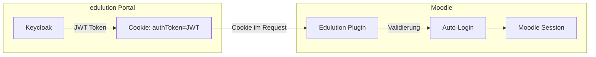

# Cookie Auth (SSO)

Das Edulution Plugin unterstützt automatische Anmeldung über JWT-Token in Cookies. Dies ermöglicht nahtloses Single-Sign-On, wenn Moodle in einem iFrame eingebettet wird.

## Funktionsweise



**Ablauf:**

1. Benutzer meldet sich im Portal (edulution) an
2. Keycloak erstellt einen JWT-Token
3. Token wird als Cookie gesetzt (mit `SameSite=None; Secure`)
4. Portal lädt Moodle im iFrame
5. Browser sendet Cookie mit
6. Edulution Plugin validiert den JWT
7. Benutzer wird automatisch in Moodle angemeldet

## Konfiguration

### Voraussetzungen

- Benutzer müssen bereits in Moodle existieren (über Sync oder manuell)
- Cookie muss mit `SameSite=None; Secure` gesetzt sein
- Beide Domains müssen HTTPS verwenden

### Einstellungen

Navigieren Sie zu: **Site-Administration → Plugins → Edulution → Cookie Auth (SSO)**

| Einstellung | Beschreibung | Standard |
|-------------|--------------|----------|
| **Cookie Auth aktivieren** | Aktiviert die automatische Anmeldung | Aus |
| **Cookie-Name** | Name des Cookies mit dem JWT | `authToken` |
| **Benutzer-Claim** | JWT-Claim für den Benutzernamen | `preferred_username` |
| **Realm-URL** | Keycloak Realm URL (optional) | - |
| **Public Key** | PEM-formatierter Public Key (optional) | - |
| **Algorithmus** | JWT-Signaturalgorithmus | RS256 |
| **E-Mail-Fallback** | Nach E-Mail suchen wenn Benutzername nicht gefunden | Aus |

### Minimale Konfiguration

Wenn Sie bereits Keycloak für die Synchronisation konfiguriert haben:

1. **Cookie Auth aktivieren**: Ja
2. **Cookie-Name**: `authToken` (oder wie von Ihrem Portal gesetzt)
3. **Benutzer-Claim**: `preferred_username`

Der Public Key wird automatisch von Keycloak abgerufen.

### Manuelle Public Key Konfiguration

Falls Sie den Public Key manuell konfigurieren möchten:

1. Öffnen Sie die Keycloak Admin-Konsole
2. Gehen Sie zu: Realm Settings → Keys → Active
3. Kopieren Sie den Public Key (RS256)
4. Fügen Sie ihn mit PEM-Header ein:

```
-----BEGIN PUBLIC KEY-----
MIIBIjANBgkqhki...
-----END PUBLIC KEY-----
```

## Cookie-Anforderungen

### Für iFrame-Embedding

Das Cookie muss folgende Attribute haben:

```
Set-Cookie: authToken=<JWT>; SameSite=None; Secure; Path=/; Domain=.example.com
```

| Attribut | Wert | Grund |
|----------|------|-------|
| `SameSite` | `None` | Erlaubt Cross-Origin Cookie-Übertragung |
| `Secure` | erforderlich | SameSite=None erfordert Secure |
| `Domain` | `.example.com` | Cookie für alle Subdomains |

### Moodle Session-Konfiguration

Für iFrame-Einbettung muss Moodle ebenfalls `SameSite=None` verwenden:

```php
// In config.php
$CFG->cookiesecure = true;
$CFG->sessioncookie = '';  // Oder ein spezifischer Name
```

## JWT-Token Format

Das Plugin erwartet einen JWT mit folgender Struktur:

```json
{
  "alg": "RS256",
  "typ": "JWT"
}
{
  "iss": "https://keycloak.example.com/realms/myrealm",
  "sub": "user-uuid",
  "preferred_username": "max.mustermann",
  "email": "max.mustermann@example.com",
  "exp": 1234567890,
  "nbf": 1234567800
}
```

### Unterstützte Claims

| Claim | Verwendung |
|-------|------------|
| `preferred_username` | Primärer Benutzername (Standard) |
| `sub` | Alternative für Benutzername |
| `email` | Fallback wenn aktiviert |
| `exp` | Token-Ablaufzeit (wird geprüft) |
| `nbf` | Not-Before (wird geprüft) |
| `iss` | Issuer (wird gegen Konfiguration geprüft) |

### Verschachtelte Claims

Das Plugin unterstützt Punkt-Notation für verschachtelte Claims:

```json
{
  "user": {
    "name": "max.mustermann"
  }
}
```

**Konfiguration:** `user.name`

## Testen

### Test-Seite

Öffnen Sie die Test-Seite:

```
https://moodle.example.com/local/edulution/ajax/cookie_auth_test.php
```

Diese zeigt:
- Aktueller Status (Cookie vorhanden, angemeldet, etc.)
- Konfigurationswerte
- Token-Informationen (wenn vorhanden)
- Testergebnisse der Konfiguration

### JSON-API

Für automatisierte Tests:

```
GET /local/edulution/ajax/cookie_auth_test.php?format=json
```

## Fehlerbehebung

### Cookie wird nicht gesendet

1. **SameSite prüfen:** Cookie muss `SameSite=None` haben
2. **Secure prüfen:** Beide Seiten müssen HTTPS verwenden
3. **Domain prüfen:** Cookie-Domain muss zur Moodle-Domain passen

### Token-Validierung schlägt fehl

1. **Algorithmus:** Stimmt der konfigurierte Algorithmus mit dem Token überein?
2. **Public Key:** Ist der Public Key korrekt? (Automatischer Abruf prüfen)
3. **Ablauf:** Ist der Token abgelaufen? (`exp` Claim)
4. **Issuer:** Stimmt der Issuer im Token?

### Benutzer wird nicht gefunden

1. **Benutzername:** Existiert der Benutzer in Moodle?
2. **Claim:** Ist der richtige Claim konfiguriert?
3. **Groß-/Kleinschreibung:** Moodle vergleicht case-insensitive

### Debug-Modus aktivieren

1. Aktivieren Sie "Debug-Modus" in den Cookie Auth Einstellungen
2. Aktivieren Sie Moodle Debugging: Site-Administration → Entwicklung → Debugging
3. Setzen Sie Debug-Level auf "DEVELOPER"

Debug-Meldungen erscheinen mit Präfix `[Edulution Cookie Auth]`.

## Session-Caching

Das Plugin cached validierte Token in der Session:

- Token-Hash wird gespeichert
- Bei gleichem Token wird keine erneute Validierung durchgeführt
- Cache wird bei Token-Ablauf oder Validierungsfehler gelöscht

Dies verbessert die Performance bei wiederholten Anfragen.

## Sicherheit

### Empfehlungen

- Verwenden Sie immer HTTPS
- Setzen Sie kurze Token-Ablaufzeiten (z.B. 15 Minuten)
- Aktivieren Sie SSL-Verifizierung in Produktion
- Prüfen Sie regelmäßig die Keycloak-Konfiguration

### Unterstützte Algorithmen

- RS256 (empfohlen)
- RS384
- RS512

HMAC-Algorithmen (HS256, etc.) werden **nicht** unterstützt.

## Nächste Schritte

- [Synchronisation konfigurieren](./synchronisation.md)
- [Gruppen-Namensschemas](./namensschemas.md)
