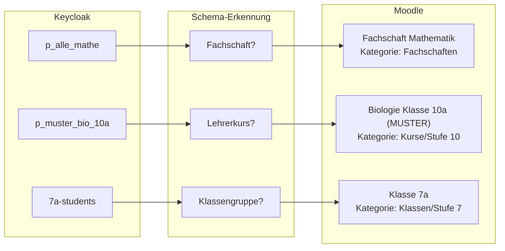

# Gruppen-Namensschemas

Das Edulution Moodle-Plugin erkennt automatisch, welche Art von Kurs aus einer Keycloak-Gruppe erstellt werden soll. Dies geschieht über **Namensschemas** - Muster, die in den Gruppennamen erkannt werden.

## So funktioniert's



## Vordefinierte Schemas

Das Plugin enthält vorgefertigte Schemas, die automatisch verschiedene Gruppentypen erkennen.

### 1. Fachschaften

**Zweck:** Kurse für alle Lehrer eines Fachs

| Keycloak-Gruppe | Moodle-Kurs | Kategorie |
|-----------------|-------------|-----------|
| `p_alle_mathe` | Fachschaft Mathematik | Fachschaften |
| `p_alle_bio` | Fachschaft Biologie | Fachschaften |
| `p_alle_de` | Fachschaft Deutsch | Fachschaften |
| `p_alle-eng` | Fachschaft Englisch | Fachschaften |

**Schema-Muster:** `p_alle_<fach>` oder `p_alle-<fach>`

**Besonderheit:** Alle Mitglieder werden automatisch als **Trainer** (editingteacher) eingeschrieben.

---

### 2. Lehrerkurse (Lehrer + Fach + Stufe)

**Zweck:** Kurse eines Lehrers für eine bestimmte Klassenstufe

| Keycloak-Gruppe | Moodle-Kurs | Kategorie |
|-----------------|-------------|-----------|
| `p_muster_mathe_10a` | Mathematik Klasse 10A (MUSTER) | Kurse/Stufe 10 |
| `p_schmidt_eng_8b` | Englisch Klasse 8B (SCHMIDT) | Kurse/Stufe 8 |
| `p_mei_de_5` | Deutsch Klasse 5 (MEI) | Kurse/Stufe 5 |

**Schema-Muster:** `p_<lehrerkürzel>_<fach>_<stufe>`

**Aufbau:**
- `p_` = Projekt-Präfix
- `<lehrerkürzel>` = 2-6 Kleinbuchstaben (z.B. `mei`, `muster`, `schmidt`)
- `<fach>` = Fachkürzel (z.B. `mathe`, `de`, `eng`, `bio`)
- `<stufe>` = Klassenstufe (z.B. `5`, `10a`, `12`)

---

### 3. Klassenkurse (Klasse + Fach)

**Zweck:** Fachkurse für eine komplette Klasse

| Keycloak-Gruppe | Moodle-Kurs | Kategorie |
|-----------------|-------------|-----------|
| `p_10a_mathe` | Mathematik 10A | Klassen/Stufe 10 |
| `p_7b_deutsch` | Deutsch 7B | Klassen/Stufe 7 |
| `p_5c_eng` | Englisch 5C | Klassen/Stufe 5 |

**Schema-Muster:** `p_<klasse>_<fach>`

**Aufbau:**
- `<klasse>` = Klassenbezeichnung (z.B. `5a`, `10b`, `7c`)
- `<fach>` = Fachkürzel

---

### 4. Arbeitsgemeinschaften (AGs)

**Zweck:** Kurse für AGs und Wahlfächer

| Keycloak-Gruppe | Moodle-Kurs | Kategorie |
|-----------------|-------------|-----------|
| `p_robotik_ag` | AG: Robotik | AGs |
| `p_theater-ag` | AG: Theater | AGs |
| `p_schulband_ag` | AG: Schulband | AGs |

**Schema-Muster:** `p_<name>_ag` oder `p_<name>-ag`

---

### 5. Klassengruppen

**Zweck:** Hauptkurse für Klassen (nicht fachspezifisch)

| Keycloak-Gruppe | Moodle-Kurs | Kategorie |
|-----------------|-------------|-----------|
| `10a-students` | Klasse 10A | Klassen/Stufe 10 |
| `7b-students` | Klasse 7B | Klassen/Stufe 7 |
| `5c-students` | Klasse 5C | Klassen/Stufe 5 |

**Schema-Muster:** `<klasse>-students`

**Hinweis:** Das `-students` Suffix kennzeichnet Klassengruppen.

---

### 6. Kursstufe (Oberstufe)

**Zweck:** Kurse für Kursstufen-Schüler

| Keycloak-Gruppe | Moodle-Kurs | Kategorie |
|-----------------|-------------|-----------|
| `k1-students` | Kursstufe K1 | Klassen/Kursstufe |
| `k2-students` | Kursstufe K2 | Klassen/Kursstufe |
| `j1-students` | Kursstufe J1 | Klassen/Kursstufe |
| `11-students` | Kursstufe 11 | Klassen/Kursstufe |

**Schema-Muster:** `<stufe>-students` wobei Stufe = k1, k2, j1, j2, ks1, ks2, 11, 12

---

### 7. Allgemeine Projekte (Fallback)

**Zweck:** Alle anderen Gruppen mit `p_` Präfix

| Keycloak-Gruppe | Moodle-Kurs | Kategorie |
|-----------------|-------------|-----------|
| `p_schulprojekt_2024` | Projekt: Schulprojekt 2024 | Projekte |
| `p_austausch_frankreich` | Projekt: Austausch Frankreich | Projekte |

**Schema-Muster:** `p_<name>` (wenn kein anderes Schema zutrifft)

---

## Fachkürzel-Übersetzung

Das Plugin übersetzt automatisch Fachkürzel in vollständige Fachnamen:

| Kürzel | Fachname |
|--------|----------|
| `m`, `ma`, `mathe`, `math` | Mathematik |
| `d`, `de`, `deutsch` | Deutsch |
| `e`, `en`, `eng`, `englisch` | Englisch |
| `f`, `fr`, `franz` | Französisch |
| `l`, `la`, `lat`, `latein` | Latein |
| `spa`, `spanisch` | Spanisch |
| `rus`, `russisch` | Russisch |
| `bio`, `biologie` | Biologie |
| `ph`, `phy`, `physik` | Physik |
| `ch`, `chem`, `chemie` | Chemie |
| `g`, `ge`, `gesch` | Geschichte |
| `geo`, `ek` | Geografie / Erdkunde |
| `gk` | Gemeinschaftskunde |
| `eth`, `ethik` | Ethik |
| `rel`, `evrel`, `krel` | Religion |
| `mus`, `mu`, `musik` | Musik |
| `bk`, `ku`, `kunst` | Kunst / Bildende Kunst |
| `spo`, `sp`, `sport` | Sport |
| `inf`, `it`, `informatik` | Informatik |
| `nwt` | NwT |
| `bnt` | BNT |
| `wbs` | WBS |

---

## Ignorierte Gruppen

Bestimmte Gruppen werden automatisch **nicht** synchronisiert:

| Muster | Beschreibung |
|--------|--------------|
| `*-parents`, `*-eltern` | Elterngruppen |
| `_internal_*` | Interne Gruppen |
| `test_*`, `debug_*` | Test- und Debug-Gruppen |

---

## Reihenfolge der Schema-Prüfung

Die Schemas werden in dieser Reihenfolge (Priorität) geprüft:

1. **Fachschaft** (`p_alle_*`) - Priorität 10
2. **Lehrerkurs** (`p_<lehrer>_<fach>_<stufe>`) - Priorität 20
3. **Klassenkurs** (`p_<klasse>_<fach>`) - Priorität 30
4. **AG** (`p_*_ag`) - Priorität 40
5. **Klassengruppe** (`*-students`) - Priorität 50
6. **Kursstufe** (`k1/k2/j1/j2-students`) - Priorität 55
7. **Projekt** (`p_*`) - Priorität 100 (Fallback)

Das **erste** passende Schema wird verwendet.

---

## Automatische Kategorie-Erstellung

Das Plugin erstellt automatisch die Kategoriestruktur basierend auf den Kursnamen. Sie können verschachtelte Kategorien definieren.

### Empfohlene Kategoriestruktur

```
Edulution/
├── Fachschaften/
│   ├── Fachschaft Mathematik
│   ├── Fachschaft Deutsch
│   └── ...
├── Klassen/
│   ├── Stufe 5/
│   │   ├── Mathematik 5A
│   │   ├── Deutsch 5A
│   │   └── ...
│   ├── Stufe 6/
│   └── ...
├── Kurse/
│   ├── Stufe 10/
│   │   ├── Biologie Klasse 10A (MUELLER)
│   │   └── ...
│   └── ...
├── AGs/
│   ├── AG: Robotik
│   └── ...
└── Projekte/
    ├── Projekt: Schulfest 2024
    └── ...
```

### Wie die Kategoriepfade funktionieren

Jedes Schema definiert einen `category_path`, der auch Variablen enthalten kann:

| Schema | category_path | Ergebnis |
|--------|---------------|----------|
| Fachschaft | `Fachschaften` | `Fachschaften/` |
| Lehrerkurs | `Kurse/Stufe {stufe\|extract_grade}` | `Kurse/Stufe 10/` |
| Klassenkurs | `Klassen/Stufe {klasse\|extract_grade}` | `Klassen/Stufe 7/` |
| AG | `AGs` | `AGs/` |
| Projekt | `Projekte` | `Projekte/` |

**Fehlende Kategorien werden automatisch erstellt!**

---

## Konfiguration im Plugin

### Standard-Vorlage (empfohlen)

Die oben beschriebenen Schemas sind als **Standard-Vorlage** voreingestellt.

**Einstellung:** `Site-Administration → Plugins → Lokale Plugins → Edulution → Erweitert → Namensschema-Vorlage`

Wählen Sie: **Standard (empfohlen)**

:::note Anpassbar
Die Standard-Vorlage ist eine Empfehlung, keine Pflicht. Sie können die Schemas jederzeit anpassen oder eine eigene Struktur definieren.
:::

### Einfache Vorlage

Für Schulen mit einfacher Struktur:

- Alle `p_*` Gruppen werden als **Projekte** angelegt
- Alle `*-students` Gruppen werden als **Klassen** angelegt

**Einstellung:** Wählen Sie: **Einfach**

### Benutzerdefinierte Vorlage

Für fortgeschrittene Anwender: Eigene Schemas als JSON definieren.

**Einstellung:** Wählen Sie: **Benutzerdefiniert** und geben Sie Ihre JSON-Konfiguration ein.

---

## Eigene Kategoriestruktur definieren

Sie können die Kategoriestruktur komplett an Ihre Schule anpassen. Hier ein Beispiel für eine alternative Struktur:

### Beispiel: Lehrer-zentrierte Struktur

```
Moodle-Kurse/
├── Lehrer/
│   ├── Müller/
│   │   ├── Biologie 10A
│   │   └── Biologie 9B
│   ├── Schmidt/
│   │   └── Mathematik 8A
│   └── ...
├── Klassen/
│   ├── 10A/
│   │   ├── Mathematik
│   │   ├── Deutsch
│   │   └── ...
│   └── ...
└── Projekte/
    ├── Schulfest 2024
    └── ...
```

**Schema-Konfiguration:**

```json
{
  "schemas": [
    {
      "id": "lehrer_kurs",
      "pattern": "^p_(?P<lehrer>[a-z]+)_(?P<fach>[a-zA-Z]+)_(?P<klasse>\\d+[a-z]?)$",
      "course_name": "{fach|map:subject_map} {klasse|upper}",
      "category_path": "Lehrer/{lehrer|titlecase}"
    },
    {
      "id": "klassen_fach",
      "pattern": "^p_(?P<klasse>\\d+[a-z])_(?P<fach>[a-zA-Z]+)$",
      "course_name": "{fach|map:subject_map}",
      "category_path": "Klassen/{klasse|upper}"
    },
    {
      "id": "projekt",
      "pattern": "^p_(?P<name>.+)$",
      "course_name": "{name|titlecase}",
      "category_path": "Projekte"
    }
  ]
}
```

### Beispiel: Fach-zentrierte Struktur

```
Unterricht/
├── Mathematik/
│   ├── Klasse 5A
│   ├── Klasse 6B
│   └── ...
├── Deutsch/
│   └── ...
└── ...
```

**Schema-Konfiguration:**

```json
{
  "schemas": [
    {
      "id": "fach_klasse",
      "pattern": "^p_(?P<klasse>\\d+[a-z])_(?P<fach>[a-zA-Z]+)$",
      "course_name": "Klasse {klasse|upper}",
      "category_path": "Unterricht/{fach|map:subject_map}"
    }
  ]
}
```

---

## Beispiele für Gruppen in Keycloak erstellen

### Beispiel: Gruppen mit sophomorix erstellen

Mit sophomorix (linuxmuster.net) erstellen Sie Projekte so:

```bash
# Fachschaft Mathematik (alle Mathe-Lehrer)
sophomorix-project -c p_alle_mathe --admins lehrer1,lehrer2

# Lehrerkurs (Herr Müller, Mathe, Klasse 10a)
sophomorix-project -c p_mueller_mathe_10a --admins mueller --members ...

# AG Robotik
sophomorix-project -c p_robotik_ag --admins technik_lehrer

# Klassenkurs (Klasse 8b, Deutsch)
sophomorix-project -c p_8b_de --admins deutschlehrer
```

### Direkt in Keycloak

Falls Sie Gruppen direkt in Keycloak erstellen:

1. Öffnen Sie die Keycloak-Administrationskonsole
2. Gehen Sie zu **Groups**
3. Klicken Sie auf **Create group**
4. Verwenden Sie die oben beschriebenen Namenskonventionen

---

## Tipps für die Benennung

### Best Practices

1. **Konsistent sein:** Verwenden Sie immer das gleiche Muster
2. **Kleinschreibung:** Alle Gruppennamen in Kleinbuchstaben
3. **Keine Sonderzeichen:** Nur Buchstaben, Zahlen, Unterstriche und Bindestriche
4. **Kurze Lehrerkürzel:** 2-6 Buchstaben (z.B. `mei` statt `meier`)

### Häufige Fehler vermeiden

| Falsch | Richtig | Grund |
|--------|---------|-------|
| `P_Alle_Mathe` | `p_alle_mathe` | Kleinschreibung verwenden |
| `p_herr_müller_mathe_10a` | `p_muel_mathe_10a` | Kurzes Kürzel, keine Umlaute |
| `p_Mathe-10a` | `p_10a_mathe` | Klasse vor Fach |
| `p_ag_robotik` | `p_robotik_ag` | AG am Ende |

---

## Fehlerbehebung

### Gruppe wird nicht erkannt

1. **Muster prüfen:** Entspricht der Gruppenname einem der Schemas?
2. **Präfix prüfen:** Beginnt die Gruppe mit `p_` oder endet mit `-students`?
3. **Groß-/Kleinschreibung:** Ist alles kleingeschrieben?
4. **Ignorierte Patterns:** Enthält der Name `-parents`, `-eltern`, `test_` oder `_internal_`?

### Falscher Kursname

1. **Fachkürzel prüfen:** Ist das Kürzel in der Übersetzungstabelle?
2. **Schema-Reihenfolge:** Das erste passende Schema wird verwendet
3. **Prioritäten:** Fachschaft (10) wird vor Projekt (100) geprüft

### Vorschau nutzen

Im Dashboard können Sie vor der Synchronisierung eine **Vorschau** anzeigen lassen. Diese zeigt:

- Welche Gruppen erkannt wurden
- Welches Schema angewendet wird
- Wie der Kursname lauten wird
- In welcher Kategorie der Kurs erstellt wird

---

## Nächste Schritte

- [Synchronisation konfigurieren](./synchronisation.md)
- [Kategorien einrichten](./umgebungsvariablen.md#gruppen-sync)
- [Dashboard nutzen](../administration/admin-ui.md)
