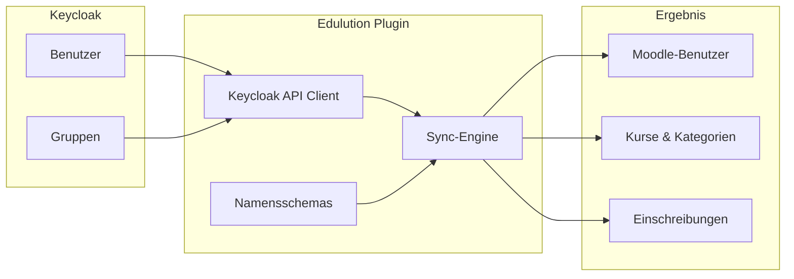

# Synchronisation

Das Edulution-Plugin synchronisiert Benutzer, Gruppen und Rollen automatisch von Keycloak nach Moodle. Die gesamte Konfiguration erfolgt über die Moodle-Administration.

## Funktionsweise



## Einrichtung

### 1. Keycloak-Verbindung konfigurieren

Navigieren Sie zu: **Site-Administration → Plugins → Lokale Plugins → Edulution → Übersicht**

Oder nutzen Sie den **Einrichtungsassistenten** beim ersten Start.

Erforderliche Einstellungen:
- **Server-URL**: Die URL Ihres Keycloak-Servers (z.B. `https://keycloak.schule.de`)
- **Realm**: Der Keycloak-Realm (z.B. `master` oder Schulname)
- **Client-ID**: Die Client-ID für Moodle
- **Client-Secret**: Das Client-Secret

### 2. Synchronisierung aktivieren

In den Keycloak-Einstellungen:
- **Automatische Synchronisierung aktivieren**: Ja
- **Synchronisierungs-Intervall**: z.B. "Jede Stunde"

## Benutzer-Synchronisation

### Attribut-Mapping

| Keycloak | Moodle | Beschreibung |
|----------|--------|--------------|
| `username` | `username` | Benutzername |
| `email` | `email` | E-Mail-Adresse |
| `firstName` | `firstname` | Vorname |
| `lastName` | `lastname` | Nachname |

### Lehrer-Erkennung

Das Plugin erkennt Lehrer automatisch anhand eines Keycloak-Attributs:

**Einstellung:** Site-Administration → Plugins → Edulution → Synchronisierung

| Einstellung | Beschreibung | Standard |
|-------------|--------------|----------|
| **Rollen-Attribut** | Das Keycloak-Attribut mit der Rolle | `sophomorixRole` |
| **Wert für Lehrer** | Der Wert, der Lehrer kennzeichnet | `teacher` |

Das Standard-Attribut ist `sophomorixRole`, kann aber angepasst werden.

### Moodle-Rollen

Je nach erkannter Rolle werden Benutzer mit verschiedenen Moodle-Rollen eingeschrieben:

| Benutzertyp | Moodle-Rolle | Kann bearbeiten? |
|-------------|--------------|------------------|
| Lehrer | `editingteacher` | Ja |
| Schüler | `student` | Nein |
| Schuladmin | `manager` | Ja |

## Gruppen-Synchronisation

### Intelligente Namensschemas

Das Plugin erkennt automatisch verschiedene Gruppentypen anhand ihrer Namen und erstellt entsprechende Kurse mit passenden Kategorien.

:::tip Detaillierte Dokumentation
Eine vollständige Übersicht aller Namensschemas finden Sie unter [Gruppen-Namensschemas](./namensschemas.md).
:::

**Beispiele:**

| Keycloak-Gruppe | Moodle-Kurs | Kategorie |
|-----------------|-------------|-----------|
| `p_alle_mathe` | Fachschaft Mathematik | Fachschaften |
| `p_mueller_bio_10a` | Biologie Klasse 10A (MUELLER) | Kurse/Stufe 10 |
| `p_8b_deutsch` | Deutsch 8B | Klassen/Stufe 8 |
| `p_robotik_ag` | AG: Robotik | AGs |
| `10a-students` | Klasse 10A | Klassen/Stufe 10 |

### Automatische Filterung

Das Plugin ignoriert automatisch folgende Gruppen:
- `*-parents`, `*-eltern` (Elterngruppen)
- `test_*`, `debug_*` (Testgruppen)
- `_internal_*` (Interne Gruppen)

### Einschreibungen

Mitglieder einer Keycloak-Gruppe werden automatisch in den entsprechenden Moodle-Kurs eingeschrieben:

- **Lehrer**: Werden als Trainer (editingteacher) eingeschrieben
- **Schüler**: Werden als Teilnehmer (student) eingeschrieben

:::info Fachschafts-Besonderheit
Bei **Fachschaften** (`p_alle_*`) werden alle Mitglieder automatisch als **Trainer** eingeschrieben.
:::

## Synchronisierungs-Optionen

Navigieren Sie zu: **Site-Administration → Plugins → Edulution → Synchronisierung**

### Benutzer-Optionen

| Option | Beschreibung | Empfehlung |
|--------|--------------|------------|
| **Neue Benutzer anlegen** | Benutzer aus Keycloak automatisch in Moodle anlegen | Aktiviert |
| **Bestehende Benutzer aktualisieren** | Name/E-Mail synchron halten | Aktiviert |

### Vorsichtige Optionen

:::warning Achtung
Diese Optionen können Daten löschen! Nur aktivieren, wenn alle Benutzer ausschließlich über Keycloak verwaltet werden.
:::

| Option | Beschreibung | Empfehlung |
|--------|--------------|------------|
| **Fehlende Benutzer sperren** | Benutzer sperren, wenn nicht mehr in Keycloak | Nur bei 100% Keycloak |
| **Entfernte Benutzer abmelden** | Aus Kursen abmelden, wenn aus Gruppe entfernt | Vorsichtig verwenden |

## Manueller Sync

### Über das Dashboard

1. Navigieren Sie zu: **Site-Administration → Plugins → Edulution → Übersicht**
2. Klicken Sie auf **"Vorschau anzeigen"** um zu sehen, was synchronisiert wird
3. Klicken Sie auf **"Jetzt synchronisieren"**

### Über die Kommandozeile

```bash
# Synchronisierung starten
php /var/www/html/local/edulution/cli/sync.php

# Mit Vorschau (dry-run)
php /var/www/html/local/edulution/cli/sync.php --preview
```

## Automatische Synchronisierung

Die Synchronisierung läuft automatisch als Moodle Scheduled Task:

- **Task:** `\local_edulution\task\sync_keycloak`
- **Standard-Intervall:** Jede Stunde (konfigurierbar)

### Intervall ändern

1. Site-Administration → Plugins → Edulution → Keycloak
2. **Synchronisierungs-Intervall** ändern

Verfügbare Intervalle:
- Alle 15 Minuten
- Alle 30 Minuten
- Jede Stunde
- Alle 6 Stunden
- Alle 12 Stunden
- Einmal täglich

## Kategorie-Einstellungen

Navigieren Sie zu: **Site-Administration → Plugins → Edulution → Kurskategorien**

| Einstellung | Beschreibung |
|-------------|--------------|
| **Übergeordnete Kategorie** | Wählen Sie eine bestehende Kategorie oder lassen Sie "Edulution" erstellen |
| **Name der Hauptkategorie** | Name für neue Kategorie (wenn erstellt) |

Unterkategorien (Fachschaften, Klassen, etc.) werden automatisch erstellt.

## Fehlerbehebung

### Verbindung testen

Im Dashboard wird der Verbindungsstatus automatisch angezeigt. Bei Problemen:

1. Prüfen Sie die Keycloak-URL (erreichbar?)
2. Prüfen Sie Client-ID und Client-Secret
3. Prüfen Sie den Realm-Namen

### Benutzer wird nicht synchronisiert

1. Hat der Benutzer in Keycloak ein gültiges Attribut für die Rolle?
2. Ist der Benutzer Mitglied einer Gruppe, die synchronisiert wird?
3. Prüfen Sie die Debug-Logs: Site-Administration → Berichte → Live Logs

### Gruppen werden nicht erkannt

1. Entspricht der Gruppenname einem der [Namensschemas](./namensschemas.md)?
2. Beginnt die Gruppe mit `p_` oder endet mit `-students`?
3. Wird die Gruppe durch ein Ignore-Pattern ausgeschlossen?
4. Nutzen Sie die **Vorschau-Funktion** im Dashboard zum Testen

### Kategorien werden nicht erstellt

Die Kategorien werden automatisch erstellt. Stellen Sie sicher:
1. Der Moodle-Admin hat Rechte zum Erstellen von Kategorien
2. Die übergeordnete Kategorie existiert (oder "Edulution" wird erstellt)

## Best Practices

### Vor dem ersten Sync

1. **Vorschau nutzen:** Zeigt was synchronisiert wird, ohne Änderungen
2. **Backup erstellen:** Sichern Sie die Moodle-Datenbank
3. **Mit kleiner Gruppe testen:** Erstellen Sie eine Testgruppe in Keycloak

### Produktivbetrieb

- **Sync-Intervall:** Jede Stunde ist ein guter Kompromiss
- **Benutzer sperren:** Erst aktivieren wenn stabil läuft
- **Logs prüfen:** Regelmäßig nach Fehlern schauen

## Nächste Schritte

- [Gruppen-Namensschemas](./namensschemas.md) - So benennen Sie Keycloak-Gruppen richtig
- [Plugin-Verwaltung](./plugins.md) - Zusätzliche Moodle-Plugins installieren
