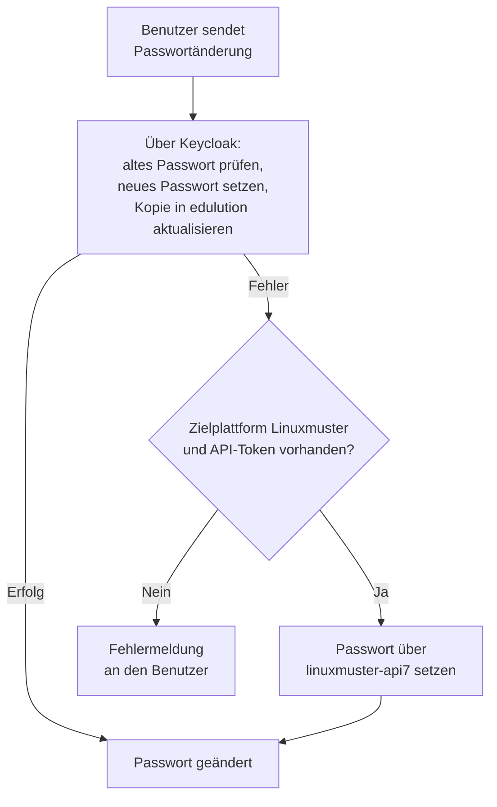

---
sidebar_custom_props:
  audience: admin
---

# Passwortänderung einrichten

Benutzer ändern ihr Passwort selbst über **Benutzereinstellungen → Sicherheit → Passwort ändern**. Diese Änderung läuft über **Keycloak**: edulution prüft das bisherige Passwort am Keycloak-Realm und setzt das neue Passwort über die Keycloak-Administrationsschnittstelle. Auf Linuxmuster-Systemen bleibt die Linuxmuster-API als **Rückfallweg** erhalten, falls die Änderung über Keycloak nicht möglich ist.

Diese Seite beschreibt, was dafür in Keycloak und – für den Rückfallweg – auf dem Linuxmuster-Server eingerichtet sein muss. Die Bedienung aus Benutzersicht ist unter [Benutzereinstellungen → Sicherheit](../erste-schritte/benutzereinstellungen/sicherheit.md#passwort-ändern) beschrieben.

## Ablauf einer Passwortänderung



1. **Aktuelles Passwort prüfen** – edulution fordert mit Benutzername und altem Passwort ein Token am OIDC-Token-Endpunkt des edulution-Realms an. Schlägt das fehl, ist das eingegebene Passwort falsch.
2. **Neues Passwort setzen** – über die Keycloak-Administrationsschnittstelle wird das Passwort des Benutzers ersetzt, womit von nun an dass neue Passwort gültig ist.
3. **Hinterlegte Kopie aktualisieren** – edulution hält eine verschlüsselte Kopie des Passworts vor, die Dienste wie WebDAV und das Mailsystem benötigen. Sie wird mitgeführt, und das zwischengespeicherte Linuxmuster-API-Token wird verworfen, damit die nächste Anfrage ein neues Token mit dem geänderten Passwort erhält muss die Kopie aktualisiert werden.
4. **Rückfallweg Linuxmuster** – schlägt einer der Schritte fehl, wiederholt edulution die Änderung über `linuxmuster-api7`. Das geschieht nur, wenn die **Zielplattform** auf **Linuxmuster** steht und für den Benutzer ein gültiges Linuxmuster-API-Token vorliegt. In allen anderen Fällen erhält der Benutzer die Fehlermeldung.

:::note[Prüfung des alten Passworts auf Linuxmuster-Systemen]
Der Rückfallweg greift bei **jedem** Fehler des Keycloak-Wegs – also auch dann, wenn das eingegebene aktuelle Passwort nicht stimmt. Die Linuxmuster-API prüft es in diesem Fall gegen die in edulution hinterlegte Kopie. Eine falsche Eingabe wird also weiterhin abgewiesen, die Meldung stammt dann jedoch aus dem zweiten Durchlauf.
:::

## Voraussetzungen in Keycloak

Die folgenden Einstellungen nehmen Sie in der Keycloak-Administrationsoberfläche vor. Realm- und Client-Namen entnehmen Sie den Variablen `KEYCLOAK_EDU_UI_REALM` und `KEYCLOAK_EDU_UI_CLIENT_ID` aus `/srv/docker/edulution-ui/edulution.env`.

### Keycloak-Administrationsoberfläche aufrufen

1.  **Adresse:** Rufen Sie die URL Ihrer edulution Plattform gefolgt von
    `/auth` auf. *Beispiel:* `https://ui.musterschule.de/auth`

2.  **Anmeldung:**

    - **Benutzername:** `admin`
    - **Passwort:** Das Passwort finden Sie in der Konfigurationsdatei
      auf Ihrem Server.

3.  **Passwort finden:** Verbinden Sie sich per SSH mit Ihrem Server und
    lassen Sie sich den Inhalt der Datei anzeigen:

    ```bash
    cat /srv/docker/edulution-ui/edulution.env | grep KEYCLOAK_ADMIN_PASSWORD
    ```

    Der Befehl zeigt Ihnen die Zeile mit dem benötigten Passwort an.

### Einstellungen im Realm

| Voraussetzung | Ort in Keycloak | Wozu |
|---|---|---|
| **Direct access grants** aktiviert | **Clients → *edu-ui-Client* → Settings → Capability config** | Nur damit kann edulution das **aktuelle** Passwort prüfen. Ohne diese Option schlägt bereits der erste Schritt fehl. |
| Gültige Admin-Zugangsdaten | `KEYCLOAK_ADMIN` und `KEYCLOAK_ADMIN_PASSWORD` in `/srv/docker/edulution-ui/edulution.env` | edulution setzt das neue Passwort über die Administrationsschnittstelle. Stimmen die Zugangsdaten nicht, kann kein Passwort geschrieben werden. |
| Passwortrichtlinie | **Authentication → Policies → Password policy** | Das neue Passwort muss der Richtlinie des Realms genügen, sonst weist Keycloak es zurück. |
| LDAP-Verbund im Modus **WRITABLE** | **User federation → *LDAP-Verbund* → Edit mode** | Stammen die Benutzer aus einem LDAP-Verzeichnis, kann Keycloak das Passwort nur bei `WRITABLE` zurückschreiben. Bei `READ_ONLY` oder `UNSYNCED` landet die Änderung nicht im Verzeichnis. |

:::warning[Passwortrichtlinie und Eingabemaske]
Das Formular in den Benutzereinstellungen prüft lediglich, ob das neue Passwort mindestens **8 Zeichen** lang ist. Alle weiteren Anforderungen stammen aus der Passwortrichtlinie des Realms und werden erst beim Speichern geprüft. Legen Sie eine strengere Richtlinie fest, weisen Sie Ihre Benutzer darauf hin – sie erhalten sonst erst nach dem Absenden eine allgemeine Fehlermeldung.
:::

:::info[LDAP-Verbund auf Linuxmuster-Systemen]
Auf Linuxmuster-Systemen steht der LDAP-Verbund üblicherweise auf `READ_ONLY`, weil die Benutzer vom Schulserver verwaltet werden. Der Keycloak-Weg schlägt dann fehl, und die Änderung läuft über den unten beschriebenen Rückfallweg. Das ist ein gültiger Betriebszustand – die Passwortänderung funktioniert, benötigt aber eine erreichbare Linuxmuster-API.
:::

## Voraussetzungen für den Rückfallweg (Linuxmuster)

Der Rückfallweg ist nur auf Linuxmuster-Systemen verfügbar und setzt voraus:

- **Zielplattform** steht unter [Einstellungen → Globale Einstellungen → Allgemein](./einstellungen.md#allgemein) auf **Linuxmuster**.
- Die **Linuxmuster-API** (`linuxmuster-api7`) ist auf dem Schulserver installiert und über die eingetragene externe Domain erreichbar.
- Bind-User und Edulution-Setup-Token sind eingerichtet – siehe [Anpassung am Linuxmuster-Server](../../edulution-server/installation.md).

Steht die Zielplattform auf **Allgemein**, gibt es keinen Rückfallweg: Die Passwortänderung ist dann ausschließlich über Keycloak möglich.

## Abgrenzung: Passwörter durch Administratoren zurücksetzen

Diese Seite beschreibt die Passwortänderung durch den Benutzer selbst. Das **Zurücksetzen** eines fremden Passworts durch eine Administratorin oder einen Administrator ist davon unberührt:

| Weg | Zuständig | Beschreibung |
|---|---|---|
| **Schulserver → Benutzerverwaltung → Passwort-Aktionen** | Global- und Schuladmins | Setzt Passwörter über die Linuxmuster-API neu, inklusive **Erstpasswort wiederherstellen**. Siehe [Linuxmuster / LINBO](../../edulution-server/linuxmuster.md#passwörter). |
| **Keycloak → Users → *Benutzer* → Credentials** | Keycloak-Administration | Setzt das Passwort direkt im Realm. Auf Systemen mit `READ_ONLY`-LDAP-Verbund wirkt das nicht auf das Verzeichnis zurück. |

## Fehlermeldungen

| Meldung | Ursache | Abhilfe |
|---|---|---|
| *Das aktuelle Passwort ist nicht korrekt* | Keycloak hat die Anmeldung mit dem eingegebenen alten Passwort abgelehnt. | Eingabe prüfen. Tritt die Meldung trotz korrektem Passwort auf, prüfen Sie, ob **Direct access grants** für den edu-ui-Client aktiviert ist. |
| *Passwort konnte nicht geändert werden* | Keycloak hat das neue Passwort abgelehnt oder konnte es nicht schreiben. | Passwortrichtlinie des Realms und den **Edit mode** des LDAP-Verbunds prüfen. Auf Linuxmuster-Systemen zusätzlich die Erreichbarkeit der Linuxmuster-API. |
| *Verbindung zum Authentifizierungsserver fehlgeschlagen* | Keycloak war nicht erreichbar. | Zustand des Containers `edu-keycloak` prüfen. |
| *Das Passwort muss mindestens 8 Zeichen lang sein* | Vorabprüfung im Formular. | Längeres Passwort wählen. |

## Siehe auch

- [Benutzereinstellungen → Sicherheit](../erste-schritte/benutzereinstellungen/sicherheit.md) – Passwortänderung aus Benutzersicht
- [Sicherheit & Authentifizierung](../features/sicherheit.md) – Zwei-Faktor-Authentifizierung und Passwort-Tresor
- [Anpassung am Linuxmuster-Server](../../edulution-server/installation.md) – Linuxmuster-API und Setup-Token
