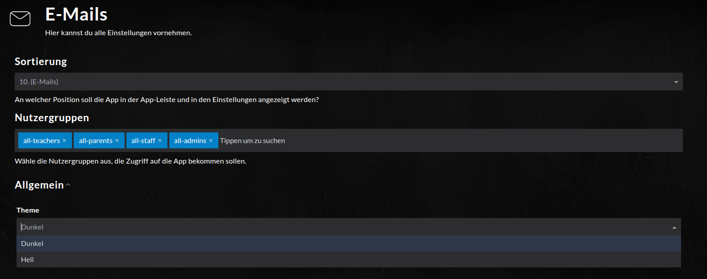

Installation
============

.. note::
   Dieser Bereich befindet sich noch im Aufbau.

2.1.1 Setup Theme Switch (edulution UI >= v1.6.14)
^^^^^^^^^^^^^^^^^^^^^^^^^^^^^^^^^^^^^^^^^^^^^^^^^^

Um aus der edulution UI Administrationsoberfläche heraus das Theme umzustellen, benötigen Sie folgende zusätzliche Schritte:

.. code-block:: bash
   :caption: SOGo Volume in edulution-api Container mounten

    # Volume mount in docker-compose.yml erstellen
    sed -i '/^\s*volumes:/a\      - /srv/docker/edulution-mail/mailcow/data/conf/sogo:/data/apps/mail/sogo/overrides:rw' /srv/docker/edulution-ui/docker-compose.yml

.. note::
   Dieser Schritt ist nur notwendig, wenn edulution-installer < `v1.0.0 <https://github.com/edulution-io/edulution-installer/releases/tag/v1.0.0>`_ verwendet wurde.

Anschließend kann in den Einstellungen zur Mail-App das Theme ausgewählt werden.

