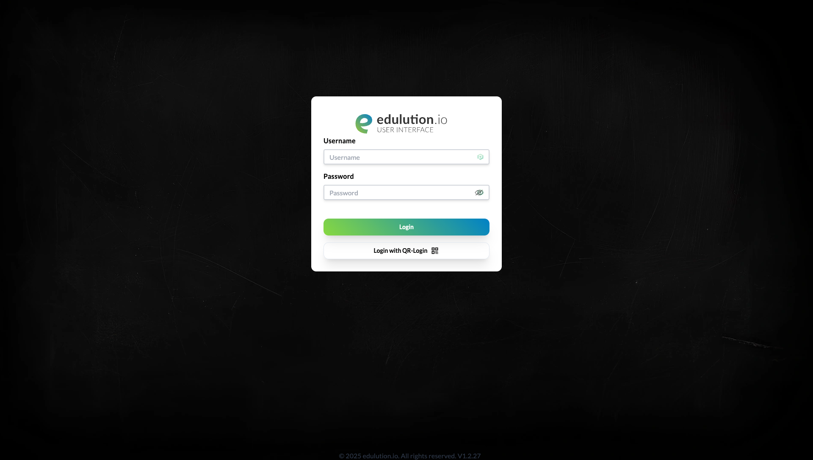
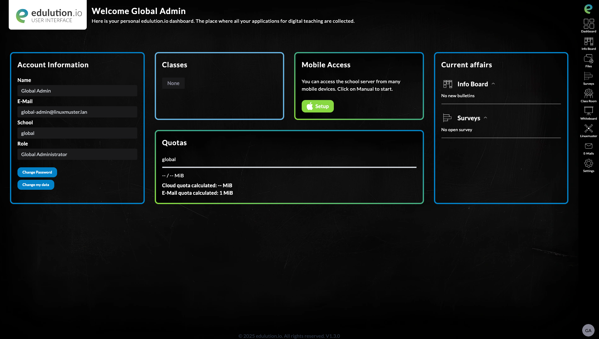
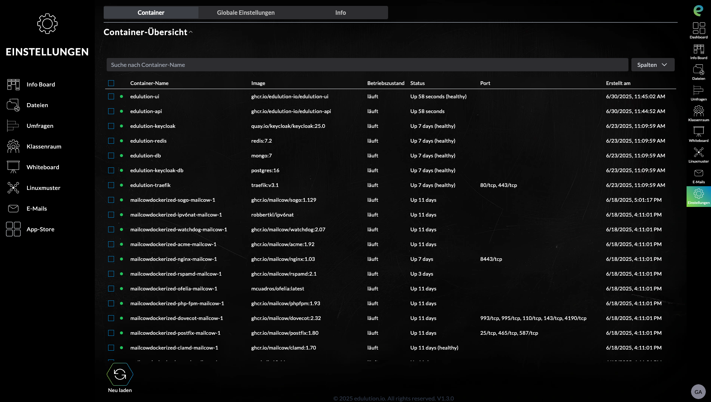
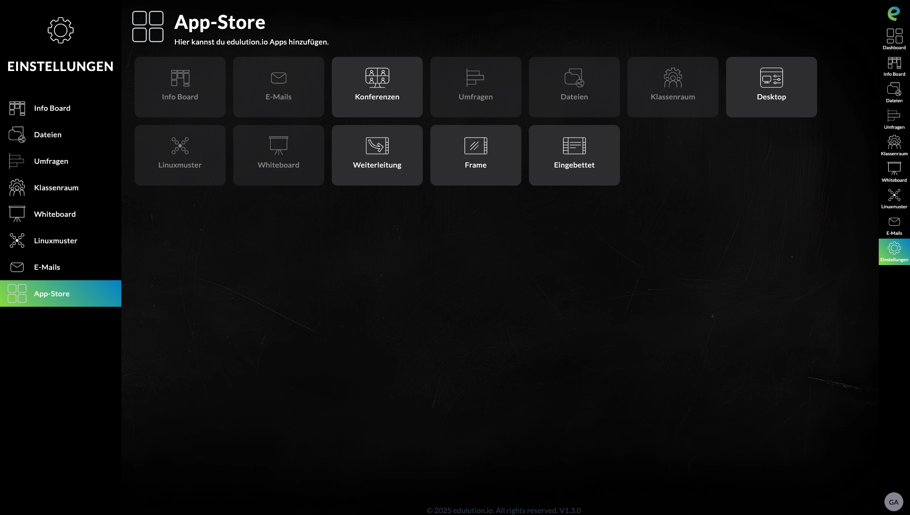
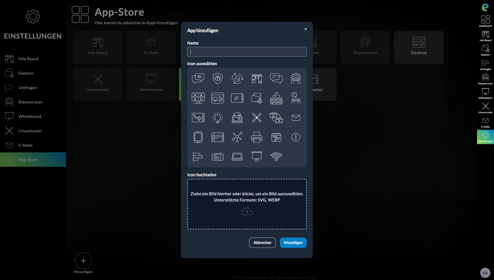
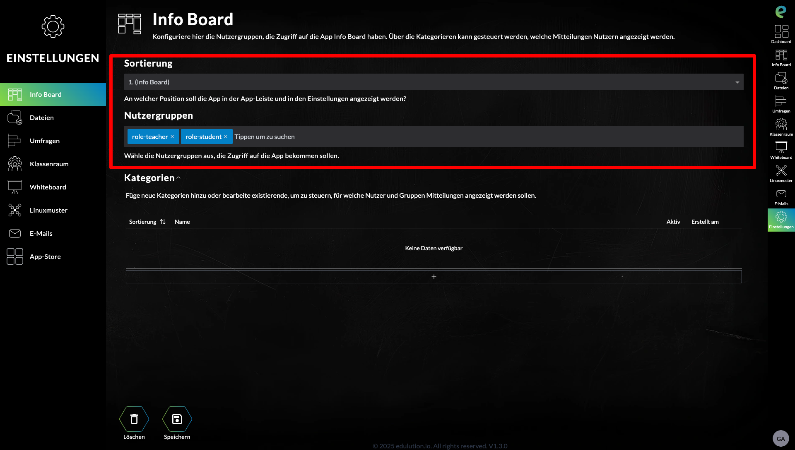
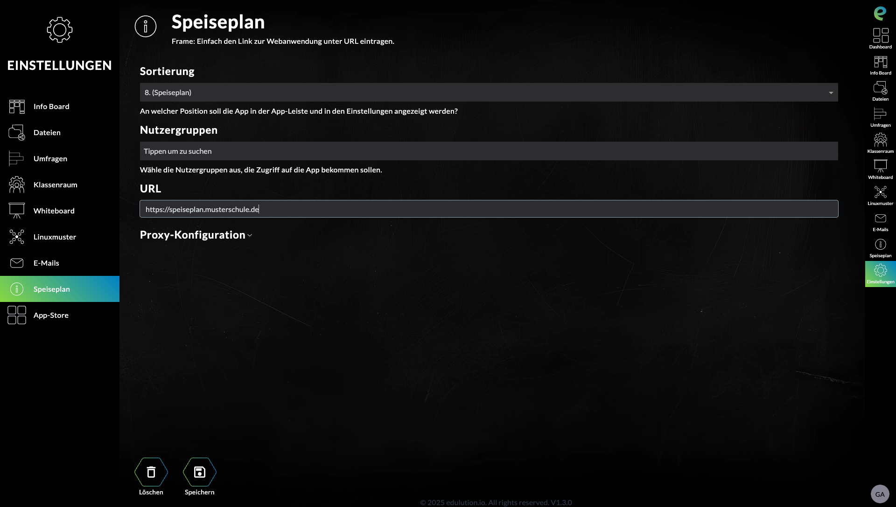

Administration
==============

Dieser Bereich beschreibt die grundlegende Verwaltung und Konfiguration der edulutionUI nach der Installation.

.. toctree::
   :maxdepth: 2
   :caption: Themen:

   experten-tipps

*********************************

2.2.1 SSL-Zertifikate sichern
^^^^^^^^^^^^^^^^^^^^^^^^^^^^^^

Es ist wichtig, Ihre SSL-Zertifikate regelmäßig zu sichern:

.. code-block:: bash
   :caption: Backup erstellen und wiederherstellen

    # Backup erstellen
    tar -czf ssl-backup-$(date +%Y%m%d).tar.gz -C /srv/docker/edulution-ui/data/traefik ssl/
    
    # Backup wiederherstellen
    tar -xzf ssl-backup-20240115.tar.gz -C /srv/docker/edulution-ui/data/traefik/

.. tip::
   Let's Encrypt Zertifikate können jederzeit neu generiert werden und müssen nicht zwingend gesichert werden.

2.3 Ports und Firewall
**********************

Die edulutionUI verwendet folgende Ports:

+----------+------------------+---------------------------------------+
| Port     | Protokoll        | Beschreibung                          |
+==========+==================+=======================================+
| 80/tcp   | HTTP             | Weiterleitung zu HTTPS                |
+----------+------------------+---------------------------------------+
| 443/tcp  | HTTPS            | Web-Interface (edulutionUI)           |
+----------+------------------+---------------------------------------+
| 143/tcp  | IMAP             | E-Mail unverschlüsselt (nur intern)   |
+----------+------------------+---------------------------------------+
| 993/tcp  | IMAPS            | E-Mail verschlüsselt (SSL/TLS)        |
+----------+------------------+---------------------------------------+

**Firewall-Konfiguration (UFW):**

.. code-block:: bash
   :caption: UFW Konfiguration

    # Ports öffnen
    ufw allow 80/tcp
    ufw allow 443/tcp
    ufw allow 993/tcp
    
    # IMAP nur intern erlauben
    ufw allow from 10.0.0.0/8 to any port 143

2.4 Updates
***********

.. index:: Updates, docker compose, Snapshot

2.4.1 edulutionUI aktualisieren
^^^^^^^^^^^^^^^^^^^^^^^^^^^^^^^^

.. danger::
   Erstellen Sie vor jedem Update einen Snapshot Ihrer VM!

Um die edulutionUI zu aktualisieren:

1. Wechseln Sie in das edulutionUI Verzeichnis:

   .. code-block:: bash

      cd /srv/docker/edulution-ui

2. Laden Sie die neuesten Container-Images:

   .. code-block:: bash

    docker compose pull

3. Starten Sie die Container neu:

   .. code-block:: bash

    docker compose up -d

4. Überprüfen Sie, ob alle Container laufen:

   .. code-block:: bash

    docker compose ps

.. note::
   Das Update dauert in der Regel nur wenige Minuten. Die edulutionUI bleibt während des Updates kurz nicht erreichbar.

2.4.2 Nach dem Update
^^^^^^^^^^^^^^^^^^^^^

Nach einem Update sollten Sie:

1. Die Funktionalität der edulutionUI testen
2. Die Logs auf Fehler prüfen: ``docker compose logs -f --tail=50``
3. Bei Problemen können Sie über den VM-Snapshot zurückrollen

2.5 Erste Anmeldung und Konfiguration
**************************************

.. index:: Anmeldung, global-admin, Dashboard, App Store

2.5.1 Anmeldung als global-admin
^^^^^^^^^^^^^^^^^^^^^^^^^^^^^^^^

Nach der erfolgreichen Installation können Sie sich an der edulutionUI anmelden:

1. Öffnen Sie einen Webbrowser und navigieren Sie zur edulutionUI-URL
2. Melden Sie sich als **global-admin** an, um Konfigurationen vorzunehmen

.. warning::
   Verwenden Sie für die erste Anmeldung immer den **global-admin** Account, um alle administrativen Funktionen nutzen zu können.

2.5.2 Dashboard-Übersicht
^^^^^^^^^^^^^^^^^^^^^^^^^^

Nach der erfolgreichen Anmeldung gelangen Sie zum Dashboard:

Das Dashboard bietet Ihnen:

1. **Überblick** über alle installierten Services
2. **Schnellzugriff** auf wichtige Funktionen
3. **Systemstatus** und Benachrichtigungen
4. **Navigation** zu den Einstellungen

2.5.3 Einstellungen aufrufen
^^^^^^^^^^^^^^^^^^^^^^^^^^^

Die Einstellungen finden Sie in der rechten Seitenleiste:

Über die Seitenleiste haben Sie Zugriff auf:

- **Container-Verwaltung**
- **App Store**
- **Systemkonfiguration**
- **Benutzerverwaltung**

2.5.4 App Store - Apps installieren
^^^^^^^^^^^^^^^^^^^^^^^^^^^^^^^^^^^^

Der App Store ist der zentrale Ort für die Installation neuer Anwendungen:

1. Klicken Sie in der Seitenleiste auf **"App Store"**
2. Sie sehen eine Übersicht aller verfügbaren Apps

**App-Status verstehen:**

.. list-table::
   :widths: 30 70
   :header-rows: 1

   * - Status
     - Beschreibung
   * - **Verfügbar** (farbig)
     - App kann per Klick installiert werden
   * - **Installiert** (ausgegraut)
     - App ist bereits installiert und aktiv

**App installieren:**

1. Klicken Sie auf eine verfügbare App
2. Bestätigen Sie die Installation
3. Warten Sie, bis die Installation abgeschlossen ist
4. Die App erscheint dann ausgegraut als "Installiert"

.. tip::
   Installierte Apps sind sofort über das Dashboard oder die Navigation verfügbar.

2.5.5 App-Installation und Konfiguration
^^^^^^^^^^^^^^^^^^^^^^^^^^^^^^^^^^^^^^^

**App installieren:**

1. **App auswählen:** Klicken Sie auf das Icon der gewünschten App im App Store
2. **Hinzufügen:** Klicken Sie unten links auf **"Hinzufügen"**
3. **Grundkonfiguration:** Ein Popup öffnet sich, in dem Sie folgende Einstellungen vornehmen können:
   
   - **Name:** Anzeigename der App im Menü
   - **Icon:** Symbol für die App-Darstellung

**Nach der Installation:**

1. Die App erscheint im **rechten Menü** (Navigation)
2. Die App-Einstellungen finden Sie in der **linken Seitenleiste** (Einstellungen)
3. Über die Einstellungen können Sie weitere Konfigurationen vornehmen

**Erweiterte Konfiguration in den App-Einstellungen:**

Nach der Installation können Sie in den App-Einstellungen folgende Parameter anpassen:

- **Position:** Reihenfolge der App im Menü
- **Berechtigungen:** Wer die App sehen und nutzen kann

**Berechtigungen vergeben:**

Die App-Berechtigung kann auf verschiedene Weise eingeschränkt werden:

.. list-table::
   :widths: 25 75
   :header-rows: 1

   * - Berechtigung
     - Beschreibung
   * - **Alle Benutzer**
     - App ist für alle sichtbar
   * - **Linuxmuster Gruppen**
     - App nur für ausgewählte Klassen/Gruppen (z.B. 5a, 10b, Lehrer-AG)
   * - **Linuxmuster Rollen**
     - App nur für spezifische Rollen:
       
       - ``teacher`` (Lehrkräfte)
       - ``student`` (Schüler)  
       - ``schooladministrator`` (Schuladministrator)
       - ``globaladministrator`` (Global-Administrator)

**Beispiel Info Board Konfiguration:**

Das Screenshot zeigt die Berechtigungseinstellungen für das Info Board. Hier können Sie präzise festlegen, welche Benutzergruppen oder Rollen Zugriff auf die jeweilige App haben.

.. note::
   **Integration mit Linuxmuster:** Die edulutionUI nutzt die vorhandenen Gruppen und Rollen aus Ihrem Linuxmuster-System. Sie müssen keine separaten Berechtigungen pflegen.

2.6 App-Typen und Konfiguration
*******************************

.. index:: App-Frame, URL-Frame, externe Dienste

2.6.1 App Frame - Externe Webseiten einbinden
^^^^^^^^^^^^^^^^^^^^^^^^^^^^^^^^^^^^^^^^^^^^

Mit dem **App Frame** können Sie externe Webseiten direkt in die edulutionUI einbetten.

**Konfiguration eines App Frames:**

1. Wählen Sie **"App Frame"** aus dem App Store
2. Geben Sie die **URL** der zu framenden Seite ein
3. Konfigurieren Sie Name und Berechtigungen

.. warning::
   **Wichtiger Hinweis:** Die externe Webseite muss das Einbetten in Frames erlauben. Seiten mit strikten `X-Frame-Options` oder `Content-Security-Policy` können nicht geframt werden.

**Beispiele für App Frame Nutzung:**

- **Speiseplan** der Schulkantine
- **Vertretungsplan** 
- **Externe Lernplattformen**
- **Schulspezifische Dienste**

**Technische Voraussetzungen:**

- Die Ziel-URL muss über HTTPS erreichbar sein
- Die Webseite darf keine Frame-Embedding-Beschränkungen haben
- Die Seite sollte responsive Design unterstützen

.. tip::
   Testen Sie App Frames zunächst in einem Browser-Tab, um sicherzustellen, dass die Seite korrekt angezeigt wird.

.. seealso::
   - :doc:`../installation/installation` - Grundinstallation der edulutionUI
   - Weitere App-Dokumentationen (folgen in den nächsten Abschnitten)

.. toctree::
   :maxdepth: 2

   experten-tipps