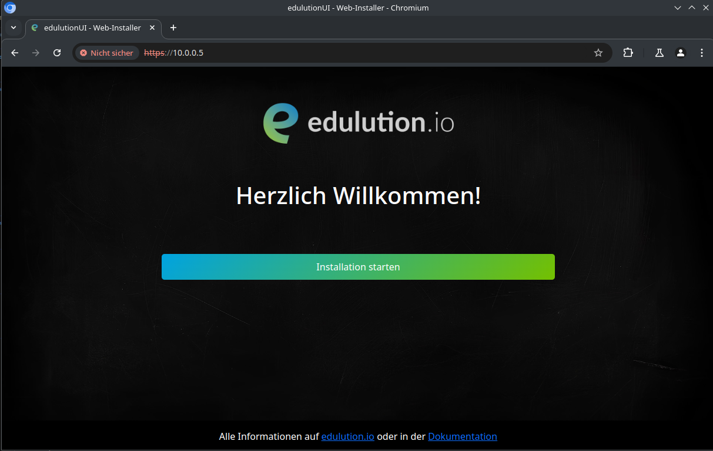
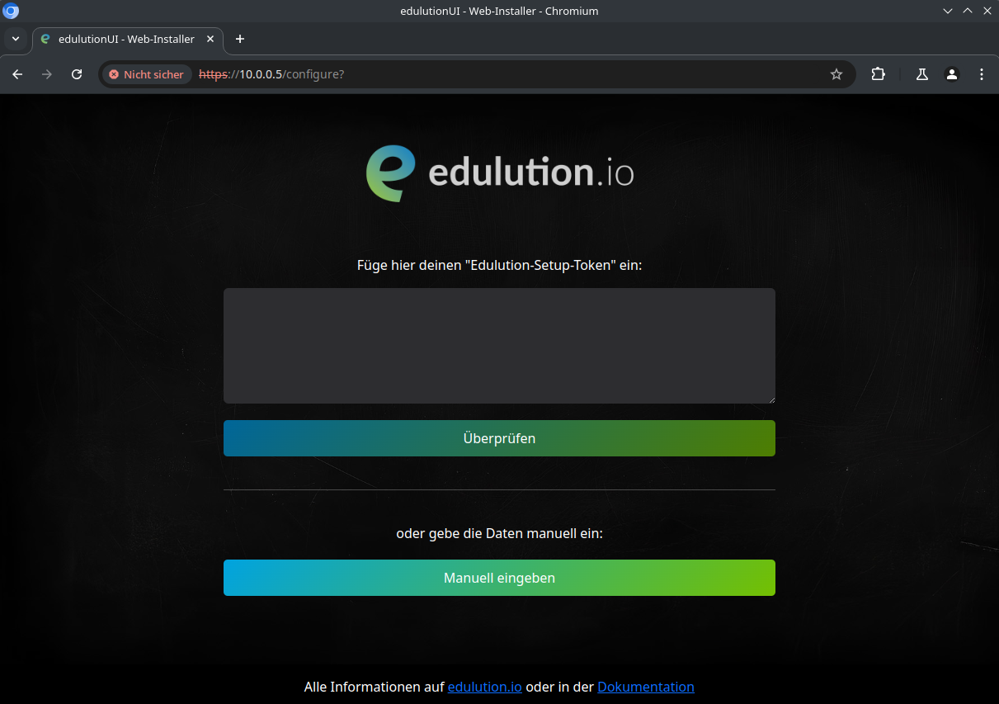
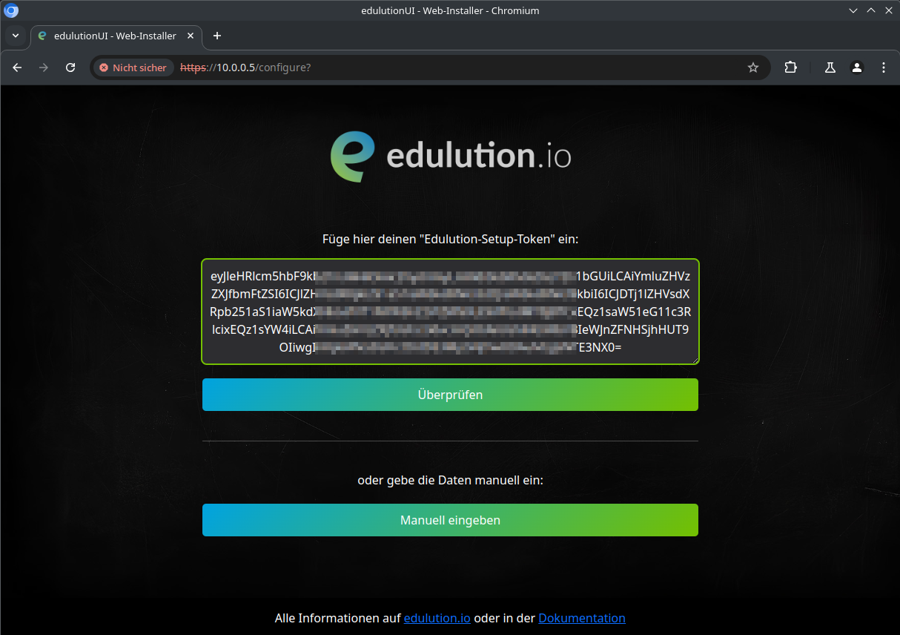
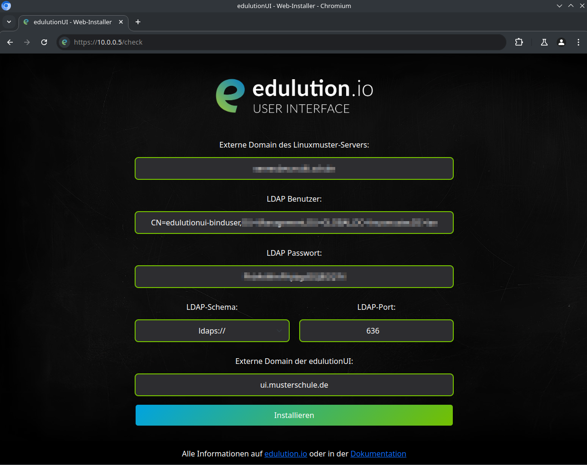
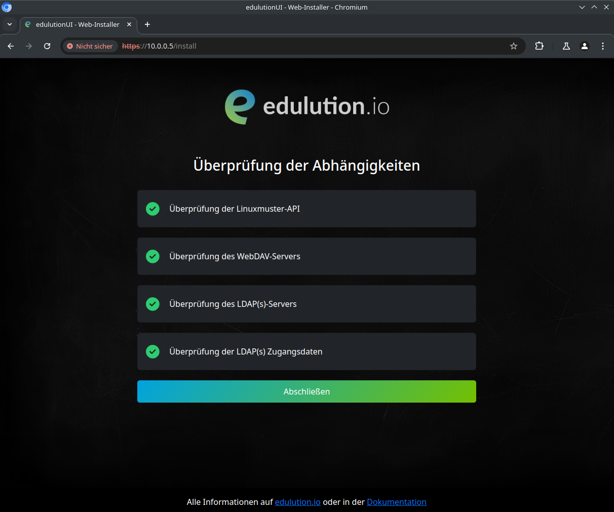
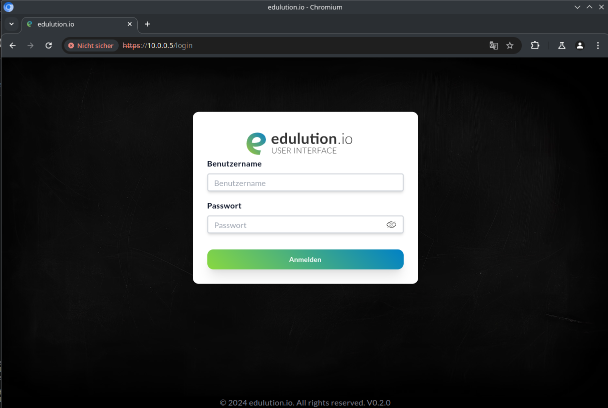

Einrichtung
***********

.. index:: Installation, curl, docker compose

1. Um das Installationsprogramm herunterzuladen wir das Programm ``curl`` benötigt. Dieses kann über folgenden Befehl installiert werden:

   .. code-block:: bash

    apt-get update && apt-get -y install curl

2. Nun kann das Installationsprogramm gestartet werden. Der Link hierzu kann unter https://get.edulution.io abgerufen werden.

   .. code-block:: bash

    bash <(curl -s https://get.edulution.io/installer)

3. Das Installationsprogramm startet und installiert alle benötigten Pakete. Sobald folgende Meldung erscheint, geht es weiter:

   .. code-block:: text

      [*] Starte den edulution UI Web-Installer...

      ########################################################

          edulution UI Web-Installer
          
          Sie erreichen die Oberfläche wie folgt:
          
          https://ui01:443
          https://10.0.0.5:443

      ########################################################

4. Der Web-Installer kann mit einem Browser über die IP-Adresse oder über die vorbereitete Domain aufgerufen werden.

5. Im ersten Schritt, kann das Edulution-Setup-Token oder über "Manuell eingeben" die Daten manuell eingegeben werden.

6. Ist der Edulution-Setup-Token gültig, wird der Button "Überprüfen" aktiviert und die Daten können auf der nächsten Seite überprüft werden.

7. Hier sollten die Daten auf Richtigkeit und geprüft bzw. manuell eingegeben werden.

   .. warning::
      - Um LDAPs (Port 636) zu verwenden, wird ein gültiges LDAP-Zertifikat benötigt!
      - Unter "Externe Domain der edulution UI" **muss** die Domain stehen, unter der die edulution UI erreichbar ist. **Der Zugriff von einer anderen Domain aus ist nicht möglich!**

8. SSL-Zertifikat Konfiguration

   Nach der Grundkonfiguration werden Sie nach der SSL-Zertifikat Einrichtung gefragt.

   .. note::
      Falls Ihre edulution UI hinter einem Reverse-Proxy betrieben wird, der bereits SSL-Terminierung übernimmt, können Sie diesen Schritt überspringen.

   Sie haben folgende Optionen:

   * **Let's Encrypt Zertifikat** (empfohlen für öffentliche Domains):
     
     - Geben Sie Ihre Domain ein (z.B. ui.musterschule.de)
     - Das System versucht automatisch ein Let's Encrypt Zertifikat zu beziehen
     - Voraussetzung: Die Domain muss öffentlich erreichbar sein und auf diesen Server zeigen
     - Bei Erfolg wird das Zertifikat automatisch alle 90 Tage erneuert

   * **Selbstsigniertes Zertifikat** (für Testumgebungen):
     
     - Lassen Sie das Feld leer oder klicken Sie auf "Selbstsigniertes Zertifikat erstellen"
     - Sie werden nach folgenden Informationen gefragt:
       
       - Ländercode (z.B. DE)
       - Bundesland/Provinz
       - Stadt
       - Organisation
       - Gültigkeitsdauer in Tagen (Standard: 365)

   * **Eigenes Zertifikat hochladen** (für vorhandene Zertifikate):
     
     - Laden Sie Ihr Zertifikat (.crt, .pem, .cer, .cert) und den privaten Schlüssel (.key, .pem) hoch
     - Stellen Sie sicher, dass die Zertifikate im korrekten Format vorliegen

   .. tip::
      **Reverse-Proxy Erkennung**: Das System erkennt automatisch, ob es hinter einem Reverse-Proxy läuft. In diesem Fall wird die SSL-Konfiguration übersprungen.

.. note::
   **Placeholder für SSL-Konfiguration Screenshot**
   
   Hier wird der Screenshot des SSL-Konfigurationsschritts eingefügt, sobald verfügbar.

9. Anschließend wird der Zugriff auf die Linuxmuster-WebUI (Port 443), die Linuxmuster-API (Port 8001) und der Zugriff, sowie die Anmeldung am LDAP-Server getestet. Sind alle Tests bestanden, kann die Installation abgeschlossen werden.

10. Erscheint in der Konsole folgender Text, ist die Installation abgeschlossen und die edulution UI kann verwendet werden!

   .. code-block:: text

      ########################################################

        ____ _ _   _      _                                   _     _ 
       / ___| (_) (_) ___| | ____      ___   _ _ __  ___  ___| |__ | |
       | |  _| | | | |/ __| |/ /\ \ /\ / / | | | '_ \/ __|/ __| '_ \| |
       | |_| | | |_| | (__|   <  \ V  V /| |_| | | | \__ \ (__| | | |_|
       \____|_|\__,_|\___|_|\_\  \_/\_/  \__,_|_| |_|___/\___|_| |_(_)
                                                                      
          Die Installation der edulution UI ist abgeschlossen!

          Sie erreichen die Oberfläche wie folgt:
          
          https://ui01:443
          https://10.0.0.5:443                                                                 

      ########################################################

